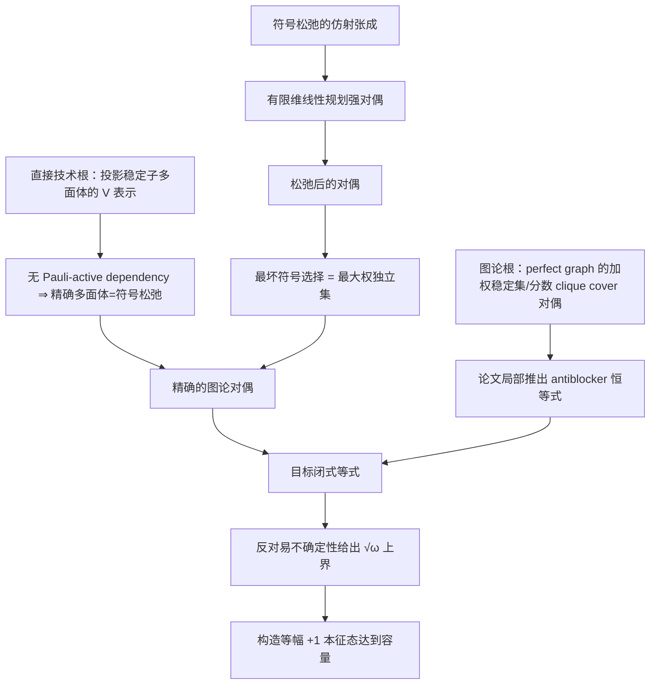

# Stabilizerness 论文的 AgtXIv 首个实现切片

## 当前结论

已经得到一个可运行、可追问、但**尚未科学验收**的纵向原型。正确的工作顺序不是先凭历史印象挑根论文，而是先建立整篇论文的原子 claim DAG，再从中选择一个目标子图，沿承重边反向寻找 practical roots，最后正向重建和验证。本轮首个目标子图是论文中最承重的闭式等式；整篇分支图和根分类见 [`DAG_AND_ROOTS.md`](DAG_AND_ROOTS.md)。

原型的结构校验通过；科学发布门仍为 `BLOCKED`。最重要的原因不是代码失败，而是我们在一个外部根论文的证明中发现了具体缺口。这个例子正好说明 AgtXIv 的核心价值：**论文引用了一条结论，不等于系统已经接受了这条结论。**

锁定版本的 Lean 4 根数学工程现有 43 个承重声明通过全量构建、占位符扫描和逐声明公理审计，状态为 `ROOT_MATH_KERNEL_COMPLETE`。它从带相位 Pauli 生成元推导一般稳定子码维数和投影，构造而非假设 Clifford witness，证明共同本征空间定义与 Clifford 轨道定义给出同一纯态集合和同一凸包，并闭合所有比特数上的完整 RoM 可行性、最优解存在、faithfulness 与确定性 atom-preserving 映射单调性。这个状态只关闭三个概念根中选定的承重**数学接口**；source convention、Veitch 物理 protocol 到形式接口的对应、选择测量分支和人类语义复核仍未关闭，所以三个 Root PaperAgents 继续全部 `accepted=false`。

这里还必须区分两类根：Gottesman、Veitch 2014 和 Howard–Campbell 组成“什么是稳定子态、free set 和 magic/RoM”的概念根谱系；Varela 是 reduced polytope 的直接技术依赖，Chvátal则是闭式证明的图论根。概念根不应无条件膨胀每个 theorem 的最小数学闭包。

## 先建立直觉：AgtXIv 是什么

AgtXIv 更像科学结论的构建系统，而不是一个会聊天的论文机器人：

- 冻结的论文源码像不可变的源码包；
- `ClaimContract` 像带前提和适用范围的类型化接口；
- `ReasoningStep` 像一条可检查的构建规则；
- `VerificationRecord` 像分轴测试报告；
- 未解决的依赖像编译错误，不能被流畅的自然语言隐藏。

Paper Agent 因而不是“一个人格”，而是七类可查询的静态产物：冻结来源、导入、论文局部增量、推理、验证、导出合同和未解决问题。

## Root claim 的五路验证门

每条 Root statement、assumption 和 reasoning step 现在同时回答五个彼此独立的问题：

1. `SOURCE_ALIGNMENT`：原文是否真的说了这句话，现代改写与原文是什么关系？
2. `LEAN_KERNEL`：在明确假设下，精确数学是否由 Lean 内核推出？
3. `EXACT_PHYSICAL_SEMANTICS`：Lean 中的群、向量、atom 或随机核是否确实对应论文的 Pauli、密度算符、稳定子态和自由操作？
4. `PHYSICAL_APPROXIMATION`：是否真的引入有限 shots、噪声、截断、浮点容差或其他误差模型？若有，误差如何传播？
5. `EMPIRICAL`：结论是否依赖数值数据或实验复现？

核心规则是：**Lean 尚未证明不等于物理近似。** 缺少形式化、缺库、相位约定待核、跨论文定义桥未闭合、开放问题或已有反例，都必须保留各自状态。只有同时给出精确母命题、近似映射、控制参数、误差模型、适用域和下游传播规则时，才能进入物理近似路线。

三个概念 roots 当前讨论的都是理想有限维精确理论，因此它们的 `PHYSICAL_APPROXIMATION` 和 `EMPIRICAL` 全部为 `NOT_APPLICABLE`。26 个 Root 对象的五路覆盖由独立 validator 强制检查。

## 论文在解决什么问题

在稳定子输入、Clifford 门、相应 Pauli/计算基测量和经典控制组成的受限 stabilizer computation 中，整个计算过程可以高效经典模拟；这不是“某个状态本身被模拟”的无条件断言。超出稳定子态凸包的资源通常叫 magic 或 nonstabilizerness。完整的 magic 稳健性（robustness of magic，后文简称 RoM）要面对数量极大的稳定子态，并且一般需要完整层析。该经典模拟范围由 Gottesman 1998 的操作定理单独承担。

论文改为只观察有限个 Pauli 期望值。可以把这理解成用一个有限坐标窗口观察完整稳定子多面体的“影子”：

```text
完整量子态 ρ
   │ 只读 M 中的 Pauli 期望值
   ▼
b_M(ρ) ∈ R^m
   │ 与投影后的稳定子多面体比较
   ▼
RoM_M(ρ) > 1  ⇒  ρ 一定有 magic
```

这里的带符号仿射分解要求系数和为 1；任何分解的一范数至少是 1，所以 1 是自然基线。投影后的值只会低估完整 RoM，因此大于 1 是可靠证据，小于等于 1 只表示这个测量窗口可能漏检。

但 fixed-window reduced RoM 不是对所有 stabilizer free operations 单调的资源 monotone。反例为固定 \(M=\{X,Z\}\)，取 Bloch vector \((1/\sqrt{2},1/\sqrt{2},0)\) 的纯态：初始窗口值为 1；自由 Clifford \(R_X(\pi/2)\) 把原本未测的 \(Y\) 分量旋到 \(Z\)，输出窗口值变成 \(\sqrt{2}\)。因此本实现统一称它为 **measurement-dependent functional / witness**。Reduced RoM 不超过 full RoM、`>1` 认证 magic，以及 measurement set 与 state 一起旋转时的 Clifford covariance 仍然成立。

## 两层结构：图只给骨架，Pauli 乘积给细节

反对易图（论文称 frustration graph）的每个节点是一项 Pauli 测量，边表示两项反对易：

- 独立集没有内部边，对应可以共同测量的一组 Pauli；
- clique 中任意两点相连，对应两两反对易的一组 Pauli；
- 图只记录“哪些方向不能同时确定”。

但图不知道同一个共同测量语境中，联合本征值允许哪些正负号。这个信息来自 Pauli 乘积关系。例如

\[
\{X_1X_2,\,Z_1Z_2,\,Y_1Y_2\},\qquad
(X_1X_2)(Z_1Z_2)(Y_1Y_2)=-I .
\]

三项彼此对易，但它们的三个本征值乘积必须是 −1。因此八个形式上的正负角点只有四个物理允许。把这条奇偶校验删除，就会产生图 1 中橙色的非物理区域。

本文把“完全落在一个共同测量语境内、因而真正限制联合符号”的最小乘积关系称为 active dependency。为避免与 AgtXIv 的科学依赖图混淆，本原型统一写成 **Pauli-active dependency**；科学论证之间的边则写成 `scientific_claim_dependency`。

## 首个目标合同

论文的定理把三个结论写在一起：闭式等式、上界和上界可达到。原型只把闭式等式选作首个目标；其余两项是下游合同。

> 设 \(M\) 是由互异、非恒等的 \(n\)-qubit Hermitian Pauli observables 组成的有限非空集合，\(\rho\) 是 \(n\)-qubit density operator。若 \(M\) 没有 Pauli-active dependency，且反对易图 \(G_M\) 是 perfect graph，那么
>
> \[
> \operatorname{RoM}_M(\rho)
> =\max\!\left(1,\max_{Q\text{ clique}}
> \sum_{P\in Q}|\operatorname{tr}(P\rho)|\right).
> \]

这是精确、理想期望值下的有限维恒等式；它不包含有限 shots、期望值估计误差、实验噪声或 qudit 外推。

“Perfect graph”不是只检查当前整张图是否满足着色数等于 clique number；它要求**每一个诱导子图**都满足这个等式。

目标合同还明确排除以下偷渡：容量 \(\sqrt{\omega}\)、多项式时间复杂度、Clifford 旋转后的覆盖率，以及论文图 2 的检测率都不是这个等式本身。

## 依赖链



这里的推理步骤有多个输入和一个输出，本质上是有向超图。实现中保留显式 `ReasoningStep` 节点，避免把联合前提压扁成含义不清的普通二元边。

### 为什么对偶会出现最大权独立集

给定对偶系数 \(y\) 后，符号松弛允许每个共同测量语境内的正负号逐项对齐 \(y_i\)。因此最坏约束变成

\[
\sum_{i\in S}|y_i|+|\mu|,
\]

再对所有可共同测量集合 \(S\) 最大化，正好是以 \(|y_i|\) 为节点权重的最大权独立集问题。这是图结构进入优化的直接原因，不是一个事后类比。

### 为什么最后只需看 clique

Perfect graph 的加权多面体对偶把“所有独立集约束”压缩成 clique incidence vectors 的凸组合。于是任意可行 witness 的值都不超过 1 和各 clique 绝对期望和中的最大值；反过来，常数 witness 达到 1，沿某个 clique 对齐符号的 witness 达到该 clique 的绝对期望和，因此上下界闭合。

下面始终区分四个量：

- state-specific reduced RoM：\(\operatorname{RoM}_M(\rho)\)，给定状态 \(\rho\) 和测量窗口 \(M\) 后的值；
- witness capacity：\(\sup_\rho\operatorname{RoM}_M(\rho)\)，固定窗口后对所有状态取上确界；
- detection coverage：在指定状态样本、旋转数量和判断阈值下，被检测出的样本比例；
- full state magic：完整资源量，不可由 capacity 或 coverage 反推。

## 上界的物理图像

一个反对易 clique 是一组高维 Bloch 球正交轴。若

\[
A=\sum_i a_iP_i,\qquad \sum_i a_i^2=1,
\]

由于不同 \(P_i\) 反对易，交叉项抵消并有 \(A^2=I\)。任意量子态的这些期望值因此落在单位欧氏球内：

\[
\sum_i\langle P_i\rangle^2\le 1.
\]

再由一范数不超过 \(\sqrt q\) 倍二范数，大小为 \(q\) 的 clique 给出 \(\sqrt q\) 上界；等幅方向 \(1/\sqrt q\) 能达到它。这解释的是 witness capacity。它不是某个给定状态的 magic 总量，也不是随机旋转后的检测覆盖率。

## 直接技术根论文的证明缺口

目标论文导入了 Varela 等人的投影多面体 V 表示。这条 statement 与目标需要的接口对齐，但其 arXiv 源码附录第 716–720 行使用了一个错误的中间断言：任意满秩稳定子群与测量集合的交，自动是该测量集合中的 maximal commuting context。

反例是两比特 \(M=\{Z_1,X_2\}\) 和状态 \(|00\rangle\)。交集只固定 \(Z_1\)，但仍可以加入与它对易的 \(X_2\)。投影点 \((1,0)\) 不是方形顶点，而是 \((1,1)\) 与 \((1,-1)\) 的中点。

这**没有推翻 V 表示的结论**。它只推翻了原证明中的一个 bijection。自然修补方式是：

1. 每个允许的 maximal signed commuting context 都能扩展成一个完整稳定子态；
2. 非 maximal 的稳定子投影可通过联合测量/去相干，分解成 maximal-context 顶点的凸组合；
3. maximal-context 候选点的 \(\pm1\) 坐标已经饱和，任何凸分解中的每一项都必须同号且包含该语境，由 maximality 得到分解平凡。

候选修补证明已写入根 Agent，并经过两名独立 Agent 逐步审计。审计结论是 `CONDITIONAL_PASS`：路线在当前 Agent 审计下可行，但 signed-Pauli 边界、“可交换 Pauli 集可扩展为满秩稳定子群”所依赖的基础引理、来源到规范化 statement 的对齐和人类语义复核尚未关闭。因此当前精确状态是：`source_fidelity=PASSED`；`published_proof_check=FAILED (gap found)`；`repair=INDEPENDENT_DERIVATION_CONDITIONAL`。定理 statement 目前没有反例，不能写成“根定理错误”或“已经修好并验证”。

## 四个独立回归例

数值脚本不依赖论文图 2 的缺失代码，并且固定为无随机性的有限实例：

| 例子 | 作用 | 结果 |
|---|---|---|
| \(M=\{X,Y,Z\}\) | 正例，图为 \(K_3\) | 对 \(\rho=[I+(X+Y+Z)/\sqrt3]/2\)，direct RoM = graph formula = \(\sqrt3\)；该态恰好饱和 capacity \(\sqrt3\) |
| \(M=\{X_1,X_2,Z_1Z_2\}\) | 非完全 perfect graph 正例 | 对 \(\rho=[I+(X_1+Z_1Z_2)/\sqrt2]/4\)，direct RoM = graph formula = \(\sqrt2\)；该态恰好饱和 capacity \(\sqrt2\) |
| \(M=\{XX,ZZ,YY\}\) | 几何负控件 | 精确四面体 4 个角、松弛立方体 8 个角；使用的 \(b=(1,1,1)\) 是非量子可实现的几何伪点 |
| \(M=\{XX,ZZ,YY,IX,XI\}\) | 物理态负控件 | 对 \(\psi=(|00\rangle+|01\rangle+(1+i)|10\rangle)/2\)，\(b=(1/2,-1/2,1/2,1/2,1/2)\)；图 perfect 但有 Pauli-active dependency，graph formula = 1，而 exact projected RoM = \(5/4\) |

最后一个例子同时给出显式 primal 和 dual certificate，所以它不仅是浮点优化器吐出的数字。它证明 Pauli-active 前提不能从目标合同中删除。

有限例全部通过只表示回归测试通过；它不能证明“对所有 \(n\)、所有密度算符”的定理。

## 当前对象映射

| AgtXIv 对象 | 原型位置 | 作用 |
|---|---|---|
| SourceAnchor | `agents/*/source/anchors.jsonl` | arXiv 版本、字节哈希、TeX 行号 |
| Statement | `agents/*/knowledge/statements.jsonl` | 原子定义、假设和结论 |
| ReasoningStep | `agents/*/reasoning/chains.jsonl` | 输入、输出、操作、前提和验证引用 |
| VerificationRecord | `agents/*/verification/records.jsonl` | 来源、数学、计算和物理语义分轴证据 |
| ClaimContract | `agents/*/exports/*.json` | 可导入结论、前提、适用范围、版本和 blocker |
| Manifest | `agents/*/agent.json`、`release-manifest.json` | Agent 布局和发布门 |

另外把原文使用但未正式定义 schema 的 ImportMatch、Blocker 和 ExternalFoundation 也实现成了一等记录。

Pauli 测量对象必须同时保存两种表示：用于期望值的带符号 Hermitian representative，以及用于反对易图和核计算的 phase-free 二进制辛向量。只保存 “Pauli modulo phase” 会在期望符号和 Clifford 共轭时丢失语义。

## 对 AgtXIv Phase 0–9 的覆盖

| Phase | 本轮动作 | 状态 |
|---|---|---|
| 预处理：whole-paper DAG | 建立 definitions、主定理、capacity、Clifford、numerics 和 SRE 等 branches；区分承重边与 mere citations | `DONE_FOR_CURRENT_SOURCE` |
| 0 选择目标子图 | 从整篇 DAG 选择闭式等式，并把上界、attainment、复杂度和数值覆盖率拆开 | `DONE` |
| 1 冻结来源 | 冻结目标、三个 conceptual roots 与 Varela 技术依赖的 arXiv source bundles，记录字节哈希和 TeX 行锚点 | `DONE_FOR_CURRENT_BUNDLES` |
| 2 原子化与规范化 | 固定闭式等式的量词、域、相位约定和排除项 | `DONE_FOR_PILOT` |
| 3 反向追依赖 | 从闭式等式追到 V 表示、线性规划对偶和 perfect-graph 加权对偶 | `DONE` |
| 4 划定 practical roots | 先分出 Gottesman→Veitch→Howard conceptual spine，再分出 Varela、Chvátal 与声明式数学 foundations 的技术闭包 | `DONE_FOR_CURRENT_DAG` |
| 5 构建 Root PaperAgents | 三个 conceptual agents 的承重数学接口已 Lean 闭合；source/physical-semantics 验收仍有 blocker。Varela technical agent 已增加独立 Lean 工程：测量坐标投影、投影凸体语义及条件式双包含已通过内核检查，两个修补前提仍未闭合 | `PARTIAL` |
| 6–7 正向重建 | 闭式目标切片有 15 个显式 ReasoningSteps；加入概念 roots、Gottesman 群平均步骤和独立的 Gottesman→Veitch 定义桥后，全仓当前为 23 个，引用关系保持无环 | `DONE_FOR_PILOT` |
| 8 对抗审计 | 多 Agent 找到根证明 gap、相位歧义和前提负控件 | `PARTIAL` |
| 9 发布 | 当前共有 7 个 ClaimContracts，全部 `accepted=false` | `BLOCKED` |

这张表中的 `DONE` 只表示该工作流阶段对首个切片已执行，不表示目标定理已验证闭合。

## 如何运行

从仓库根目录执行：

```bash
python3 tools/validate_pilot.py
python3 tools/validate_pilot.py --strict-science
python3 tools/validate_lean_formalization.py
python3 tools/validate_varela_formalization.py
python3 tools/validate_root_partitions.py
python3 agents/graph-theoretic-nonstabilizerness/computational/verify_closed_form.py \
  --output agents/graph-theoretic-nonstabilizerness/verification/logs/finite-instance-results.json
python3 tools/query_agent.py why statement:2607.26154v1:closed-form-equality
```

第一条应通过结构校验；第二条应以非零状态退出，因为科学 blocker 尚未关闭；第三条会在锁定的 Lean/Mathlib/窄 LeanQuantum Pauli 依赖环境中重新构建并审计 43 个 Root 承重声明；新增的第四条独立验证 6 个声明——5 个 Varela 投影/条件修补声明和 1 个显式图论基础接口——并核对源码哈希、禁止占位符与逐声明公理；第五条检查三个 Root Agent 的五路分流是否完整，并禁止把未形式化项伪装成近似。`query_agent.py` 的每个答案都带 `DIRECT_SOURCE`、`IMPORTED_CONTRACT`、`DERIVED_FROM_ACCEPTED_CHAIN`、`UNVERIFIED_INFERENCE` 或 `BLOCKED` 之一，不允许查询层用自然语言补洞。

## 多轴状态

| 轴 | 当前状态 | 解释 |
|---|---|---|
| 来源一致性 | `PASSED` | 5 个 PaperAgents 的 source bundles、26 个 artifacts 与 32 个 claim anchors 已通过哈希校验 |
| 依赖闭包 | `BLOCKED` | Gottesman→Veitch→Howard 的数学桥已闭，但 source/physical-semantics 验收、V-representation 修补和 perfect-graph primary source 仍未关闭 |
| 目标局部数学 | `LOCAL_SOURCE_DERIVATION_CHECKED_WITH_BLOCKED_IMPORTS` | 本地步骤已逐步重建，但不能越过被阻塞 import |
| fixed-window monotonicity | `FAILED` | 显式 Clifford 反例表明 fixed-\(M\) reduced RoM 不是一般 stabilizer monotone；应降为 measurement-dependent witness |
| 有限实例计算 | `REPRODUCED` | 4 个自建、确定性有限例回归通过；不是 universal theorem proof，也不是图 2 reproduction |
| 论文图 2 | `BLOCKED` | 无代码、raw data、seed、采样分布和容差 |
| 形式化 | `ROOT_MATH_KERNEL_COMPLETE` + `VARELA_PARTIALLY_FORMALIZED_EXPLICIT_OBLIGATIONS` | Root 工程的 43 个声明已闭。独立 Varela 工程另有 6 个声明通过构建、hash、placeholder 和 axiom audit：其中 5 个覆盖精确坐标投影、投影凸体语义、极大共同测量语境的数据结构，以及“candidate physicality + projected-atom refinement ⇒ 凸包相等”的条件推导；第 6 个只检查图论外部基础作为显式参数的使用。两个 V-representation 前提与候选点极端性仍未形式化，图论定理本身和目标闭式也未验收 |
| 物理近似 | `NOT_APPLICABLE_FOR_THREE_ROOTS` | 三篇根的当前合同都是精确理想理论；未完成的 Lean 或语义桥保持阻塞，不转写为近似 |
| 物理语义 | `AGENT_REVIEWED` | 已审查“窗口、容量、覆盖率”区别；尚无人类签名 |

因此总状态只能是 `PARTIALLY_VERIFIED`，导出合同 `accepted=false`。结构校验绿色不能自动把数学、物理或复现轴变绿。

## 下一步优先级

1. 对三个 Root 的 agent-normalized 数学接口做独立 source-convention 与人类物理语义复核；特别核对 `SemanticClifford` 的 Pauli-normalizer 定义与来源术语，而不把它误称为已经提取出的 H/S/CNOT 电路。
2. 把 Veitch 的确定性 trace-preserving stabilizer protocol 精确映射到已形式化的 atom-preserving density-map 接口；若合同需要选择测量，再另建 branch probability 与 on-average monotonicity 合同。
3. 继续关闭 V-representation Lean 合同中公开列出的两个承重义务：每个允许符号的极大语境都能实现为稳定子投影；每个投影纯稳定子 atom 都能按 Born 权重细分为极大语境候选点。随后单独证明这些候选点的极端性。
4. 冻结并核对 Chvátal 的 perfect-graph 加权对偶来源；在此之前只把它作为 Lean 定理的显式外部参数，不写自定义公理，也不把条件结论标成无条件证明。
5. 在现有 pinned Lean 4 工程中实现目标论文的“自由符号最大化”和“松弛顶点仿射张成”，随后才推进闭式等式本身；不得把 full-RoM 单调性继承给 fixed-window functional。
6. 将对象、状态转换与版本兼容升级为正式 JSON Schema；把 Clifford rotation coverage 与图 2 保留为独立 empirical branch，没有作者代码/数据前保持 `NOT_ATTEMPTED/BLOCKED`。

## 相关入口

- 整篇 claim DAG 与根分类：`DAG_AND_ROOTS.md`
- 目标源码：`arXiv-2607.26154v1/draft.tex`
- Gottesman concept root：`../agents/stabilizer-codes-and-quantum-error-correction/agent.json`
- Veitch free-set root：`../agents/resource-theory-of-stabilizer-computation/agent.json`
- Howard–Campbell RoM root：`../agents/robustness-of-magic/agent.json`
- Lean 4 根数学切片：`../formal/AgtXIvRootMath/README.md`
- Lean 4 动态验证器：`../tools/validate_lean_formalization.py`
- Varela 测量投影形式化切片：`../formal/AgtXIvVarela/README.md`
- Varela 动态验证器：`../tools/validate_varela_formalization.py`
- Root 五路分流 schema：`../schemas/root-verification-partition.schema.json`
- Root 五路动态验证器：`../tools/validate_root_partitions.py`
- 下载的根源码：`../Reference/Predicting magic from very few measurements/pra_version.tex`
- 目标合同：`../agents/graph-theoretic-nonstabilizerness/exports/closed-form-equality.json`
- 根证明缺口：`../agents/predicting-magic-from-very-few-measurements/reviews/vrep-proof-gap.md`
- Fixed-window monotonicity 反例：`../agents/predicting-magic-from-very-few-measurements/reviews/reduced-rom-monotonicity-counterexample.md`
- 修补候选：`../agents/predicting-magic-from-very-few-measurements/reasoning/repaired-vrep-proof-candidate.md`
- 数值证据：`../agents/graph-theoretic-nonstabilizerness/verification/logs/finite-instance-results.json`
