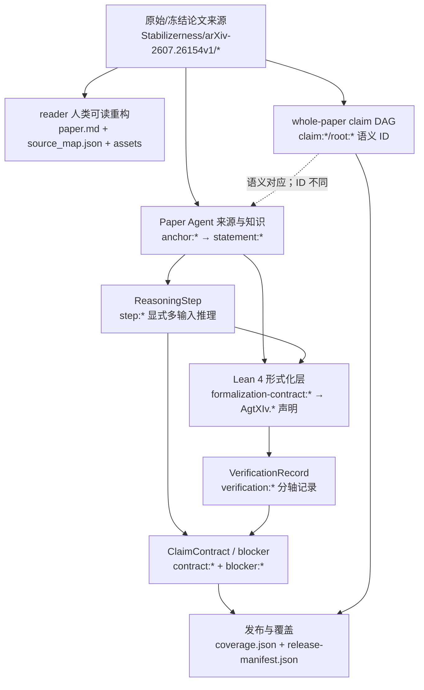
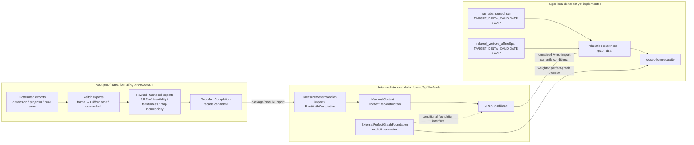

# Stabilizerness 当前工件综合索引

> 本报告是一次只读整理。它只转述工作区内现有源码、JSON/JSONL 记录和说明文档，不重新运行 Lean build、validator、测试、哈希检查或科学正确性审查。凡涉及 ``通过''、``失败''、``已检查'' 等状态，均应理解为**现有记录所述**，而不是本报告的独立背书。

## 1. 执行摘要

当前文件体系已经形成一条可查询但尚未科学验收的纵向原型：冻结论文来源经 reader 层重构为聚焦读本，整篇论文被拆成 74 个节点、129 条边的 claim DAG，首个闭式等式切片又被实例化为 Paper Agent 的 Statement、ReasoningStep、VerificationRecord 和 ClaimContract；三个概念根的选定数学接口另落在 Lean 4 工程中。总发布状态仍是 `PARTIALLY_VERIFIED`，`accepted_release=false`，目标合同 `contract:2607.26154v1:closed-form-equality` 的 `accepted=false`（`release-manifest.json`；`agents/graph-theoretic-nonstabilizerness/exports/closed-form-equality.json`）。

最重要的结构性区别有三点：

1. `Stabilizerness/dag/claim-dag.json` 是**整篇论文的语义审计图**，覆盖定义、主定理、capacity、Clifford、数值和 SRE 等分支；`graph/claim-dependencies.json` 只是闭式等式 pilot 的 20 节点推理切片，不能替代前者（`Stabilizerness/DAG_AND_ROOTS.md`；`graph/claim-dependencies.json`）。
2. `formal/AgtXIvRootMath/` 形式化的是 Gottesman → Veitch → Howard--Campbell 三个**概念根的选定数学接口**，不是目标论文的图论闭式定理。目标论文目前只存在排队中的形式合同 `formalization-contract:2607.26154v1:sign-max-and-affine-span`，两个预期声明尚未实现（`formal/AgtXIvRootMath/README.md`；`agents/graph-theoretic-nonstabilizerness/formal/formalization-contract.json`）。
3. 现有记录把两类 Varela 问题分开：V-representation 是 `PROOF_GAP` / `THEOREM_NOT_REFUTED` / `CONDITIONAL_REPAIR`；fixed-window monotonicity 是独立的 `CLAIM_FALSE` / `EXPLICIT_COUNTEREXAMPLE`。二者不能合并解释（`Stabilizerness/dag/claim-dag.json` 的 `root:varela-reduced-polytope` 与 `claim:fixed-window-monotonicity`；`agents/predicting-magic-from-very-few-measurements/blockers/*.json`）。
4. 新增的 `Stabilizerness/agtxiv/` 是非破坏式 canonical overlay：它只保存 manifest、node/agent/declaration 映射和历史路径分类，不替换原 DAG，不改变 Lean 可见性，也不提升任何 verification 或 acceptance 状态（`Stabilizerness/agtxiv/README.md`；`Stabilizerness/agtxiv/manifest.json`）。

## 2. 目录地图

### 2.1 `Stabilizerness/` 内部

| 路径 | 对象层 | 内容与当前用途 |
|---|---|---|
| `Stabilizerness/arXiv-2607.26154v1/draft.tex` | 原始/冻结来源 | 目标论文主 TeX；`Stabilizerness/dag/claim-dag.json` 将其记为 canonical source。|
| `Stabilizerness/arXiv-2607.26154v1/head.tex` | 原始/冻结来源 | 主稿加载的宏、版式与依赖头文件。|
| `Stabilizerness/arXiv-2607.26154v1/draft.bbl`、`appendix.bbl` | 原始/冻结来源 | 已生成参考文献工件；`00README.json` 将 `draft.tex` 标为 `toplevel`，将 `appendix.bbl` 标为 `ignore`。|
| `Stabilizerness/arXiv-2607.26154v1/fig1.pdf`、`fig2.pdf` | 原始/冻结来源 | 论文图源；bundle 中未发现用于 Fig. 2 的代码、raw data、seed 或 tolerance 记录，现有 DAG 因而保留 blocker（`claim:figure2-reproduction-blocker`）。|
| `Stabilizerness/reader/paper.md` | reader 层 | 中文聚焦读本，按 `B001`--`B010` 组织摘要、定义、exactness、MWIS、闭式、Clifford、数值和证明核心。|
| `Stabilizerness/reader/source_map.json` | reader 层 | 把 `B001`--`B010` 映射到 `draft.tex` 行号；状态为 `FOCUSED_DRAFT`，不是全文翻译。|
| `Stabilizerness/reader/translation_notes.md` | reader 层 | 术语规范、源码归一化说明和科学警示；明确区分 Pauli-active dependency 与 scientific claim dependency。|
| `Stabilizerness/reader/assets/fig1.png`、`fig2.png`、`fig3.png`、`table1.png` | reader 层 | 从原图或编译页裁出的阅读资源；实际资源 ID 为 `F001`、`F002`、`F003`、`T001`（`Stabilizerness/reader/source_map.json`）。|
| `Stabilizerness/dag/claim-dag.json` | whole-paper DAG | 74 节点、129 边的整篇 claim 审计图，paper ID 为 `arxiv:2607.26154v1`。|
| `Stabilizerness/DAG_AND_ROOTS.md` | 解释层 | 给出 14 节点读者投影、branch 划分、root 分类和 blocker 解释。|
| `Stabilizerness/AGTXIV_IMPLEMENTATION.md` | 实现总览 | 把来源、DAG、Paper Agent、Lean 与发布门连成首个实现切片，并声明科学发布门仍为 `BLOCKED`。|
| `Stabilizerness/CURRENT_ARTIFACTS_SYNTHESIS.md` | 本报告 | 面向新读者的当前工件索引，不改变任何已有状态。|

`Stabilizerness/reader/source_map.json` 明列尚未完整翻译的部分：完整参考文献、完整二进制辛预备知识、universal `2n+1` ceiling 证明、平方 Pauli profile 与 stabilizer Rényi entropy 附录。因此 reader 层应作为聚焦导航，而不能代替 `Stabilizerness/arXiv-2607.26154v1/draft.tex`。

### 2.2 根目录和跨目录工件

| 路径 | 作用 | 关键 ID / 状态 |
|---|---|---|
| `graph/claim-dependencies.json` | 闭式 pilot 的推理 incidence 图 | 20 个 statement/assumption/foundation 节点、22 条带 `via_step` 的边；`graph_kind=accepted_derivation_candidate`。|
| `graph/paper-dependencies.json` | 闭式 pilot 的论文级科学依赖图 | 仅 4 节点、3 边；文件自身声明 whole-paper lineage 在 `Stabilizerness/dag/claim-dag.json`。|
| `roots.json` | practical roots 清单 | `conceptual_spine` 三 agent；`closed_form_theorem_roots` 为 Varela agent、perfect-graph foundation、finite-LP foundation。|
| `pilot-scope.json` | 首个 vertical slice 边界 | `pilot:stabilizerness:closed-form-equality`，目标 `statement:2607.26154v1:closed-form-equality`，状态 `PARTIALLY_VERIFIED`。|
| `coverage.json` | 数量化覆盖快照 | 目标 theorem 的 `kernel_checked=0`；概念根记录为 43 个 audited declarations；这两个计数范围不同。|
| `release-manifest.json` | 发布清单与门控 | `pilot:stabilizerness:closed-form-equality:0.1.0`，`accepted_release=false`，`scientific_validation=BLOCKED`。|
| `formal/AgtXIvRootMath/` | Lean 4 概念根工程 | 默认入口 `AgtXIvRootMath.lean`，汇总面 `RootMathCompletion.lean`，记录 ID `lean-verification:root-math:2026-08-16`。|
| `agents/*/source`、`knowledge`、`reasoning`、`verification`、`formal`、`exports`、`blockers` | Paper Agent 工件 | 分别承载 SourceAnchor、Statement、ReasoningStep、VerificationRecord、形式合同、ClaimContract 和阻塞记录。|

## 3. 对象层次与数据流



各层的职责如下。

- **原始/冻结来源**保留作者文本、图和 TeX 结构；source anchor 用文件、版本、行号和已有 hash 指向它，例如 `anchor:2607.26154v1:closed-form-theorem` 指向 `draft.tex` 第 270--283 行（`agents/graph-theoretic-nonstabilizerness/source/anchors.jsonl`）。
- **reader 层**做阅读重排和术语归一化，不生成 accepted proof。例如 `B006` 是闭式公式的核心阅读块，但其来源仍由 `source_map.json` 指向 `draft.tex`。
- **whole-paper claim DAG**用 `root:*`、`foundation:*`、`claim:*` 描述整篇语义结构、branch 和状态；它不是 Paper Agent 记录的物理拼接。
- **Paper Agent 层**用 `anchor:*`、`statement:*`、`step:*`、`verification:*`、`contract:*` 和 `blocker:*` 实现可查询的细粒度对象。一个 `ReasoningStep` 可有多个输入，因此 `graph/claim-dependencies.json` 用多个 incidence edge 和同一个 `via_step` 表示超边。
- **Lean 层**把选定的 normalized mathematical statement 映射到具体声明；它只覆盖形式合同列出的精确数学范围。`formal/AgtXIvRootMath/verification-result.json` 明确把 source/physical semantics、目标图论 theorem 和 empirical reproduction 排除在 `ROOT_MATH_KERNEL_COMPLETE` 之外。

## 4. Reader 与冻结来源索引

`Stabilizerness/reader/source_map.json` 的实际 block 映射如下：

| Reader ID | 主题 | 来源锚点 |
|---|---|---|
| `B001` | 摘要 | `draft.tex:68-75` |
| `B002` | 测量窗口、投影多面体、reduced RoM | `draft.tex:113-131` |
| `B003` | frustration graph、exact V-representation | `draft.tex:134-157` |
| `B004` | sign relaxation、active dependency、exactness | `draft.tex:198-244` |
| `B005` | dual 与 maximum-weight independent set | `draft.tex:245-264` |
| `B006` | 主闭式 theorem | `draft.tex:265-287` |
| `B007` | Clifford covariance | `draft.tex:302-326` |
| `B008` | 数值结果 | `draft.tex:328-459`；资源 `F002`、`F003`、`T001` |
| `B009` | 附录承重证明片段 | `draft.tex:607-625,700-723` |
| `B010` | 展望 | `draft.tex:464-466` |

reader 中的 `fig1.png` 对应 `F001`，来源是编译稿第 2 页带 overlay 的图区；`fig2.png` 对应 `F002`，直接来自 `Stabilizerness/arXiv-2607.26154v1/fig2.pdf`；`fig3.png` 与 `table1.png` 分别对应 `F003`、`T001`，来自编译稿第 5 页（`Stabilizerness/reader/source_map.json`）。

## 5. Lean 4 工程索引

### 5.1 工程边界和顶层依赖

默认入口 `formal/AgtXIvRootMath/AgtXIvRootMath.lean` 只导入 `AgtXIvRootMath.RootMathCompletion`。后者导入：

```text
GottesmanGeneralRankDimension
GottesmanGeneralRankProjector
GottesmanGeneratorFixedSpace
UnconditionalStabilizerRoM
VeitchOrbitPolytope
```

并导出最终跨根接口 `densityFullStabilizerRoM_eq_one_iff_mem_cliffordOrbitPolytope` 与 `one_lt_densityFullStabilizerRoM_iff_magicByCliffordOrbit`（`formal/AgtXIvRootMath/AgtXIvRootMath/RootMathCompletion.lean`）。

现有记录 `formal/AgtXIvRootMath/verification-result.json` 的 ID 是 `lean-verification:root-math:2026-08-16`，列出 43 个 declarations，并声称 build、placeholder scan 和 axiom audit 通过。本报告没有重跑这些动作。`Audit.lean` 是该既有审计声明清单；`lakefile.toml`、`lean-toolchain`、`lake-manifest.json` 固定工程配置；`README.md` 解释范围。`.lake/` 是既有构建缓存与依赖副本，不是本项目手写证明层。

### 5.2 主要模块：Gottesman 稳定子码链

| 文件 | 直接主题与主要声明 | 在链中的位置 |
|---|---|---|
| `GottesmanGroupAverage.lean` | 抽象有限群平均：`groupAverage_mem_commonFixed`、`groupAverage_eq_self_iff`、`groupAverage_idempotent`、`range_groupAverageMap`、`groupAverage_isProjection`。 | 对应 `statement:9705052v1:group-sum-fixedness` → `statement:9705052v1:group-average-projector` 与 `step:9705052v1:000`（`agents/stabilizer-codes-and-quantum-error-correction/reasoning/chains.jsonl`）。|
| `PauliTrace.lean`、`PauliAdjoint.lean`、`PauliFaithful.lean` | phase-aware Pauli 的 trace、unitary/Hermitian adjoint 与矩阵表示 injectivity；代表声明 `trace_eval_eq_zero_of_support_ne_zero`、`pauli_toCMatrix_conjTranspose`、`pauli_toCMatrix_injective`。 | 支撑 Pauli character 与 projector 计算；映射到 root formal contract 的 Pauli 前提（`agents/stabilizer-codes-and-quantum-error-correction/formal/qubit-stabilizer-code-kernel.json`）。|
| `GottesmanRankPauliFrame.lean`、`GottesmanConcretePauliFrame.lean` | 二元 frame group、phase-clean independent signed frame、character 及 rank-$n$ fixed-space 一维性；代表声明 `finrank_commonFixed_eq_one`。 | rank-$n$ 早期构造层。|
| `GottesmanCharacterDimension.lean` | 从 character delta 得 fixed-space finrank 1：`finrank_commonFixed_eq_one_of_character_delta`。 | character 到维数的抽象桥。|
| `GottesmanRankNProjector.lean` | rank-$n$ group average 的 Hermitian、idempotent、PSD、trace-one、rank-one projector 与 `pureStabilizerDensity`。 | 对应 `statement:9705052v1:pure-stabilizer-state` 的 projector/purity 部分。|
| `GottesmanPauliGenerators.lean` | `CommutingInvolutivePauliGenerators`、`IndependentSignedPauliGenerators`、subset word product、`toFrame` 和纯稳定子密度。 | 从生成元输入转到 frame/projector。|
| `GottesmanGeneralRankDimension.lean` | 一般 $r\le n$ 的 character 和 `finrank_commonFixed_eq_two_pow_sub` / `...codeDimension`。 | 对应 `statement:9705052v1:stabilizer-code-fixed-space`。|
| `GottesmanGeneralRankProjector.lean` | `stabilizerCodeProjectorMatrix` 及 Hermitian、idempotent、PSD、trace、range finrank。 | 把一般维数结果提升到稳定子码 projector。|
| `GottesmanGeneratorFixedSpace.lean` | `GeneratorsFix` 与 subgroup common fixed space 等价，且存在 normalized generator-fixed vector。 | 对应生成元逐个固定与 subgroup 固定的桥。|
| `GottesmanUniqueRay.lean` | normalized fixed vectors只差 global phase 的系列定理。 | rank-$n$ pure ray 唯一性结尾。|

该组的正式映射集中在 `formalization-contract:9705052v1:qubit-stabilizer-code-kernel`，其 source statements、anchors、steps 和 declarations 全列于 `agents/stabilizer-codes-and-quantum-error-correction/formal/qubit-stabilizer-code-kernel.json`；导出仍是 `contract:9705052v1:pure-stabilizer-state`、`accepted=false`。

### 5.3 主要模块：辛坐标、Clifford witness 与 Veitch 凸包桥

| 文件 | 直接主题与主要声明 | 依赖/对应 |
|---|---|---|
| `PauliF2Support.lean`、`F2Coordinates.lean`、`F2SymplecticNondegenerate.lean` | $\mathbb F_2$ support、dot/symplectic form、坐标等价、非退化；代表声明 `pauli_commutes_iff_symplectic_eq_zero`、`coordinateEquiv`、`symplecticForm_nondegenerate`。 | Clifford 构造的线性代数底层。|
| `SymplecticCompletion.lean` | 从 independent isotropic vectors 构造 dual partners：`exists_isotropic_dualPartners`。 | 供 frame support completion。|
| `PauliFrameSupportCompletion.lean`、`PauliFrameSymplecticBasis.lean` | 生成元 support 的线性无关/isotropic 与完整 symplectic coordinates；代表声明 `exists_support_dualPartners`、`exists_support_symplecticEquiv`。 | 从 Pauli frame 到完整辛坐标系。|
| `PauliSupportWord.lean`、`PauliDualFrame.lean`、`PauliFrameNormalForm.lean` | word support、dual Paulis/frame、central phase 和 frame decomposition/transport。 | 构造 coherent Pauli normal form。|
| `SyndromeBasis.lean`、`PauliSyndromeData.lean`、`PauliSyndromeIntertwiner.lean` | syndrome basis、vacuum/read/flip states、unitary change-of-basis matrix及 conjugation intertwiner。 | 形成实际 Clifford witness 的矩阵层。|
| `SemanticClifford.lean`、`SemanticCliffordFrames.lean` | 定义 unitary Pauli normalizer `SemanticClifford`、orbit 与 frame action；代表声明 `conjugate_pauli`、`conjugate_stabilizerProjectorMatrix`。 | 注意这是 semantic normalizer，不是 H/S/CNOT gate synthesis；边界见 `formal/AgtXIvRootMath/README.md`。|
| `StandardZIndependentFrame.lean`、`StabilizerFrameProjector.lean`、`StandardZProjectorBridge.lean` | 标准 Z frame、computational zero projector 及二者相等。 | Clifford orbit 的标准基点。|
| `PauliCliffordTransitivity.lean` | `frameChangeClifford` 与 `exists_semanticClifford_map_standardIndependentZFrame`。 | 构造而非假设 frame-to-Clifford witness。|
| `VeitchStabilizerPolytope.lean`、`VeitchConvexHull.lean` | frame atoms、`StabilizerFreeByFrames` 与普通实凸包 membership。 | Veitch free-set 的 frame 表示。|
| `VeitchOrbitBridge.lean`、`VeitchOrbitEquivalence.lean`、`VeitchOrbitPolytope.lean` | frame atom ↔ semantic Clifford orbit、atom range 相等、两凸包相等；代表声明 `pureStabilizerByFrame_iff_byCliffordOrbit`、`stabilizerPolytopeByFrames_eq_byCliffordOrbit`。 | 对应 `step:1307.7171v1:000`、`:001` 和 `contract:1307.7171v1:stabilizer-polytope-and-magic-membership`。|

该组的 formal contract 是 `formalization-contract:1307.7171v1:qubit-stabilizer-polytope-kernel`，其五个主要 Lean declarations 与 scoped-out operation semantics 见 `agents/resource-theory-of-stabilizer-computation/formal/qubit-stabilizer-polytope-kernel.json`。现有记录将该 formal contract 标为 `KERNEL_CHECKED`，但 parent export 仍 `accepted=false`，blocker 为 `blocker:1307.7171v1:formalism-alignment-pending`。

### 5.4 主要模块：有限 atom RoM、全比特可行性与单调性

| 文件 | 直接主题与主要声明 | 依赖/对应 |
|---|---|---|
| `FiniteAtomRoM.lean` | 抽象有限 atom signed decomposition、`l1Cost`、`FreeByAtoms`、`normalized_l1`、faithfulness。 | Howard--Campbell 数学核心的通用层。|
| `FiniteAtomAttainment.lean`、`FiniteAtomTotalRoM.lean` | l1 minimizer 存在、total `finiteRoM`、faithfulness 与 atom-image monotonicity。 | `step:1609.07488v2:002`、`:003` 的抽象优化层。|
| `StochasticContraction.lean`、`AtomPreservingMonotonicity.lean` | row-stochastic kernel、l1 contraction、从 atom image 构造 kernel 与 output minimizer bound。 | 说明 stochastic kernel 是构造结果，不是额外输入。|
| `FiniteAtomConvexHull.lean` | `FreeByAtoms` 等价于 atom range 的凸包 membership。 | 把优化 free set 接到几何 free set。|
| `HermitianAffineFeasibility.lean`、`HermitianPauliBasis.lean` | trace-one Hermitian affine space、Pauli Hermitian basis 与 normalized signed decomposition 的一般条件。 | 全 $n$ 可行性底层。|
| `QubitStabilizerAffineComplete.lean`、`ProductStabilizerFrames.lean`、`StabilizerAffineComplete.lean` | 单比特 affine completeness、tensor/product frame 递推、完整 frame atoms 跨越 trace-one affine space；主要结尾 `traceOneHermitianAffine_le_completeFrame_affineSpan`。 | 从单比特扩展到所有 qubit 数。|
| `StabilizerAtomMaps.lean` | `StabilizerAtomMap`、free-to-free 与 `finiteRoM_mono`。 | 抽象 atom-preserving map 接口。|
| `StabilizerRoMInstantiation.lean`、`CanonicalStabilizerAtoms.lean` | 把有限 atom RoM 实例化到 complete frames，再转为 canonical atom set；faithfulness 与 map 单调性。 | 对应 normalized full-RoM statement。|
| `DensityStabilizerRoM.lean`、`UnconditionalStabilizerRoM.lean` | density 接口、无额外 completeness 参数的 `fullStabilizerRoM`、faithfulness 与 deterministic map monotonicity。 | 对应 `statement:1609.07488v2:rom-faithfulness` 和 `...:rom-monotonicity` 的精确限定版本。|
| `RootMathCompletion.lean` | 把 full RoM faithfulness 改述为 Veitch Clifford-orbit polytope membership。 | 三个概念根的最终汇合面。|

该组对应 `formalization-contract:1609.07488v2:finite-atom-rom-kernel` 与 `formalization-contract:1609.07488v2:qubit-full-rom-kernel`（`agents/robustness-of-magic/formal/*.json`）。现有记录把数学范围标为 `KERNEL_CHECKED`，但三个 exports `contract:1609.07488v2:rom-definition`、`:rom-faithfulness`、`:rom-monotonicity` 都是 `accepted=false`；共同 blocker 为 `blocker:1609.07488v2:free-set-import-alignment-pending`。

### 5.5 Lean 尚未覆盖的目标论文部分

`agents/graph-theoretic-nonstabilizerness/formal/formalization-contract.json` 的状态是 `QUEUED`，预期声明是：

- `Stabilizerness.max_abs_signed_sum`；
- `Stabilizerness.relaxed_vertices_affineSpan`。

当前 `formal/AgtXIvRootMath/AgtXIvRootMath/` 中未发现这两个声明，也未发现 `statement:2607.26154v1:closed-form-equality` 的 Lean declaration 映射。现有文件自己明确说，即使实现二者，也至多使目标达到 `PARTIALLY_FORMALIZED`。因此不能把 `ROOT_MATH_KERNEL_COMPLETE` 解释为目标 theorem 已形式化（`agents/graph-theoretic-nonstabilizerness/formal/formalization-contract.json`；`coverage.json`）。

## 6. DAG 索引

### 6.1 Whole-paper DAG 的节点与边

`Stabilizerness/dag/claim-dag.json` 的节点类别与计数为：

| kind | 数量 | 例子 |
|---|---:|---|
| `definition` | 14 | `claim:reduced-rom`、`claim:frustration-graph` |
| `lemma` | 13 | `claim:no-active-free-signs`、`claim:perfect-graph-antiblocker` |
| `proposition` | 16 | `claim:fixed-window-monotonicity`、`claim:relaxed-mwis-dual` |
| `theorem` | 7 | `claim:exact-reduced-vrep`、`claim:closed-form-rom` |
| `external_contract` | 10 | `root:gottesman-stabilizer-formalism`、`root:varela-reduced-polytope` |
| `standard_foundation` | 2 | `foundation:finite-lp-strong-duality`、`foundation:perfect-graph-complement-and-algorithm` |
| `construction` | 3 | `claim:capacity-attainment` 等 |
| `empirical_protocol` | 3 | `claim:figure2-protocol` 等 |
| `empirical_claim` | 1 | `claim:figure2-coverage-gain` |
| `limitation` | 2 | `claim:figure2-reproduction-blocker` 等 |
| `open_problem` | 3 | `claim:active-dependency-coset-decoding-open` 等 |

129 条边分为：`scientific_claim_dependency` 59 条、`definition_dependency` 52 条、`scope_dependency` 14 条、`data_dependency` 4 条（`Stabilizerness/dag/claim-dag.json`）。文件没有单独 edge ID；每条边由 `from`、`to`、`type`、`reason` 构成。

### 6.2 主要链路与 branches

闭式主干可按实际 ID 写成：

```text
root:varela-reduced-polytope
  → claim:exact-reduced-vrep
  → claim:relaxation-exactness
  → claim:exact-graph-program
  → claim:closed-form-rom

claim:sign-relaxed-polytope
  → claim:relaxed-affine-span
  → claim:relaxed-lp-dual
  → claim:relaxed-mwis-dual
  → claim:exact-graph-program

root:perfect-graph-weighted-duality
  → claim:perfect-graph-antiblocker
  → claim:closed-form-rom
```

其下游独立分支包括：

- capacity：`claim:closed-form-rom` → `claim:capacity-upper-bound` / `claim:capacity-attainment` → `claim:witness-capacity` → `claim:universal-ceiling`；
- Clifford：`claim:clifford-rom-covariance` 与 `claim:clifford-structure-invariance` → `claim:rotated-closed-form`；
- numerics：`claim:figure2-haar-input`、`claim:figure2-variational-input` → `claim:figure2-protocol` → `claim:figure2-coverage-gain`，并连到 `claim:figure2-reproduction-blocker`；
- squared profile/SRE：`claim:squared-pauli-profile` → `claim:quadratic-stabilizer-mwis`，以及 `claim:pauli-parseval` / `claim:full-pauli-independent-sets` → `claim:pure-sre-graph-identity`。

这些 branch 划分来自 `Stabilizerness/dag/claim-dag.json`，解释性摘要见 `Stabilizerness/DAG_AND_ROOTS.md`。

### 6.3 Roots 与 blockers

Whole-paper root 优先级是：

1. `root:gottesman-stabilizer-formalism`；
2. `root:veitch-stabilizer-resource-theory`；
3. `root:howard-campbell-rom`；
4. `root:varela-reduced-polytope`；
5. `root:perfect-graph-weighted-duality`。

该顺序写在 `Stabilizerness/dag/claim-dag.json` 的 `root_standardization_priority` 中。`roots.json` 则把前三者实例化为 conceptual spine agents，把 Varela、`foundation:perfect-graph-weighted-duality` 和 `statement:foundation:finite-lp-strong-duality` 放入 closed-form theorem roots。

当前承重 blockers 至少包括：

| blocker ID / DAG node | 现有记录所述状态 | 路径 |
|---|---|---|
| `blocker:2602.18939v1:root-reconstruction-pending` | `OPEN`；V-representation repair 尚有公开义务 | `agents/predicting-magic-from-very-few-measurements/blockers/root-reconstruction-pending.json` |
| `blocker:2602.18939v1:fixed-window-monotonicity-false` | `CLAIM_FALSE`；与 V-representation gap 分离 | `agents/predicting-magic-from-very-few-measurements/blockers/fixed-window-monotonicity-false.json` |
| `blocker:2607.26154v1:perfect-graph-foundation-unchecked` | `OPEN` | `agents/graph-theoretic-nonstabilizerness/blockers/perfect-graph-foundation-unchecked.json` |
| `blocker:2607.26154v1:root-contract-not-accepted` | `OPEN` | `agents/graph-theoretic-nonstabilizerness/blockers/root-contract-not-accepted.json` |
| `blocker:2607.26154v1:figure2-code-unavailable` | `OPEN` | `agents/graph-theoretic-nonstabilizerness/blockers/figure2-code-unavailable.json` |
| `claim:figure2-reproduction-blocker` | `BLOCKED` | `Stabilizerness/dag/claim-dag.json` |
| `blocker:9705052v1:root-review-open` | `OPEN` | `agents/stabilizer-codes-and-quantum-error-correction/blockers/root-review-open.json` |
| `blocker:1307.7171v1:formalism-alignment-pending` | `OPEN` | `agents/resource-theory-of-stabilizer-computation/blockers/formalism-alignment-pending.json` |
| `blocker:1609.07488v2:free-set-import-alignment-pending` | `OPEN` | `agents/robustness-of-magic/blockers/free-set-import-alignment-pending.json` |

`blocker:2607.26154v1:lean-environment-missing` 在已有记录中是 `RESOLVED`，但这只说明该历史 blocker 的记录状态，不改变目标 theorem 尚未实现的事实（`agents/graph-theoretic-nonstabilizerness/blockers/lean-environment-missing.json`；`agents/graph-theoretic-nonstabilizerness/formal/formalization-contract.json`）。

### 6.4 Whole-paper DAG、pilot 图与 Agent ID 的对应关系

三套 ID 不是同一个 namespace：

| 语义对象 | Whole-paper DAG | Paper Agent / pilot graph | 关系 |
|---|---|---|---|
| 闭式 theorem | `claim:closed-form-rom` | `statement:2607.26154v1:closed-form-equality` | 语义对应，字符串不相同；当前文件中未发现显式 machine-readable `same_as` 字段。|
| relaxation exactness | `claim:relaxation-exactness` | `statement:2607.26154v1:relaxation-exactness` | 后缀近似一致，但 namespace 不同。|
| MWIS dual | `claim:relaxed-mwis-dual` | `statement:2607.26154v1:dual-mwis` | 语义对应，命名不同。|
| perfect graph local step | `claim:perfect-graph-antiblocker` | `statement:2607.26154v1:perfect-antiblocker-local` | 语义对应，命名不同。|
| Varela root | `root:varela-reduced-polytope` | agent `agent:predicting-magic-from-very-few-measurements`，export `contract:2602.18939v1:reduced-polytope-vrep` | root node 对应一个 agent/contract 组合，不是单个 statement ID。|
| Gottesman root | `root:gottesman-stabilizer-formalism` | `agent:stabilizer-codes-and-quantum-error-correction`，`statement:9705052v1:*` | root node 粗于 agent 的多个 statements。|

`graph/claim-dependencies.json` 中的节点就是 Paper Agent statement/foundation IDs，并通过实际 `via_step` ID 连接。例如从 `statement:2607.26154v1:exact-graph-dual` 和 `statement:2607.26154v1:perfect-antiblocker-local` 到 `statement:2607.26154v1:closed-form-equality` 的两条 incidence edge 都使用 `step:2607.26154v1:008`。Whole-paper DAG 则直接用两条 `scientific_claim_dependency` 指向 `claim:closed-form-rom`，不保留 `step:*` 节点。

## 7. 从论文到 Lean/验证工件的追踪链

### 7.1 链一：Gottesman 稳定子码与纯稳定子态

**source anchor**  
`anchor:9705052v1:general-stabilizer-code`（`Reference/Stabilizer Codes and Quantum Error Correction/Thesis.tex:980-998`）及 `anchor:9705052v1:n-generator-unique-state`（同文件 `2081-2089`），记录于 `agents/stabilizer-codes-and-quantum-error-correction/source/anchors.jsonl`。

**→ normalized statement**  
`statement:9705052v1:stabilizer-code-fixed-space`、`statement:9705052v1:n-generator-unique-eigenvector`、`statement:9705052v1:pure-stabilizer-state`（`agents/stabilizer-codes-and-quantum-error-correction/knowledge/statements.jsonl`）。

**→ reasoning step/import**  
`step:9705052v1:001` 以 rank-$n$ phase-normalized assumption、fixed-space 与 unique-eigenvector statements 为输入，输出 `statement:9705052v1:pure-stabilizer-state`；状态为现有记录所述 `PARTIALLY_VERIFIED`（`agents/stabilizer-codes-and-quantum-error-correction/reasoning/chains.jsonl`）。

**→ DAG node/edge**  
Whole-paper 节点 `root:gottesman-stabilizer-formalism` 通过 `definition_dependency` 指向 `claim:full-stabilizer-polytope`，并进入 `claim:frustration-graph`、`claim:anticommuting-l2-bound` 等定义支路（`Stabilizerness/dag/claim-dag.json`）。pilot 的 `graph/claim-dependencies.json` 不包含这一概念根链，当前文件中未发现直接 incidence 映射。

**→ Lean declaration / verification artifact**  
`AgtXIv.Stabilizer.IndependentSignedPauliFrame.finrank_commonFixed_eq_two_pow_sub`、`AgtXIv.Stabilizer.stabilizerCodeProjectorMatrix_posSemidef`、`AgtXIv.Stabilizer.stabilizerProjectorMatrix_trace_one`、`AgtXIv.Stabilizer.IndependentSignedPauliGenerators.pureStabilizerDensity` 等，映射由 `formalization-contract:9705052v1:qubit-stabilizer-code-kernel` 给出（`agents/stabilizer-codes-and-quantum-error-correction/formal/qubit-stabilizer-code-kernel.json`）；verification record 为 `verification:9705052v1:lean-qubit-stabilizer-code-kernel`。

**→ export/blocker**  
`contract:9705052v1:pure-stabilizer-state`，`accepted=false`；blocker `blocker:9705052v1:root-review-open`（`agents/stabilizer-codes-and-quantum-error-correction/exports/pure-stabilizer-state.json`）。

### 7.2 链二：Veitch frame atoms 到 Clifford-orbit polytope

**source anchor**  
`anchor:1307.7171v1:stabilizer-free-set` 与跨根 `anchor:9705052v1:general-stabilizer-code`（`agents/resource-theory-of-stabilizer-computation/source/anchors.jsonl`；formal contract 中列出跨根 anchor）。

**→ normalized statement**  
`statement:1307.7171v1:pure-stabilizer-clifford-orbit`、`statement:1307.7171v1:fixed-space-clifford-orbit-equivalence`、`statement:1307.7171v1:n-qubit-stabilizer-polytope`（`agents/resource-theory-of-stabilizer-computation/knowledge/statements.jsonl`）。

**→ reasoning step/import**  
`step:1307.7171v1:000` 导入 `statement:9705052v1:pure-stabilizer-state` 并输出 fixed-space/orbit equivalence；`step:1307.7171v1:001` 再输出 `statement:1307.7171v1:n-qubit-stabilizer-polytope`（`agents/resource-theory-of-stabilizer-computation/reasoning/chains.jsonl`）。

**→ DAG node/edge**  
`root:gottesman-stabilizer-formalism` → `claim:full-stabilizer-polytope` 是 `definition_dependency`；`root:veitch-stabilizer-resource-theory` → `claim:full-stabilizer-polytope` 是 `scientific_claim_dependency`（`Stabilizerness/dag/claim-dag.json`）。

**→ Lean declaration / verification artifact**  
`AgtXIv.Stabilizer.IndependentSignedPauliFrame.exists_semanticClifford_map_standardIndependentZFrame` → `pureStabilizerByFrame_iff_byCliffordOrbit` → `stabilizerPolytopeByFrames_eq_byCliffordOrbit` → `stabilizerFreeByFrames_iff_mem_cliffordOrbitPolytope`，由 `agents/resource-theory-of-stabilizer-computation/formal/qubit-stabilizer-polytope-kernel.json` 映射；verification record 为 `verification:1307.7171v1:lean-qubit-stabilizer-polytope-kernel`。

**→ export/blocker**  
`contract:1307.7171v1:stabilizer-polytope-and-magic-membership`，`accepted=false`；blocker `blocker:1307.7171v1:formalism-alignment-pending`（`agents/resource-theory-of-stabilizer-computation/exports/stabilizer-polytope-and-magic-membership.json`）。

### 7.3 链三：Howard--Campbell full RoM faithfulness 与 deterministic monotonicity

**source anchor**  
`anchor:1609.07488v2:rom-definition`、`:rom-properties`、`:rom-property-proofs`（`agents/robustness-of-magic/source/anchors.jsonl`）。

**→ normalized statement**  
`statement:1609.07488v2:rom-definition-normalized`、`:rom-faithfulness`、`:rom-monotonicity`（`agents/robustness-of-magic/knowledge/statements.jsonl`）。

**→ reasoning step/import**  
`step:1609.07488v2:001` 导入 `statement:1307.7171v1:n-qubit-stabilizer-polytope` 规范化定义；`:002` 推出 faithfulness；`:003` 使用 `statement:1609.07488v2:stabilizer-channel-action` 推出限定范围的 monotonicity（`agents/robustness-of-magic/reasoning/chains.jsonl`）。

**→ DAG node/edge**  
`claim:full-stabilizer-polytope` → `claim:full-rom` 是 `definition_dependency`，`root:howard-campbell-rom` → `claim:full-rom` 是 `scientific_claim_dependency`；再由 `claim:full-rom` 进入 `claim:reduced-rom`（`Stabilizerness/dag/claim-dag.json`）。

**→ Lean declaration / verification artifact**  
`AgtXIv.RoM.exists_l1Minimizer`、`AgtXIv.Stabilizer.traceOne_canonicalStabilizer_feasible`、`AgtXIv.Stabilizer.fullStabilizerRoM_eq_one_iff_free`、`AgtXIv.Stabilizer.StabilizerAtomMap.fullStabilizerRoM_mono`，最终到 `densityFullStabilizerRoM_eq_one_iff_mem_cliffordOrbitPolytope`；映射见 `agents/robustness-of-magic/formal/qubit-full-rom-kernel.json`，verification records 为 `verification:1609.07488v2:lean-finite-atom-kernel` 与 `verification:1609.07488v2:lean-qubit-full-rom-kernel`。

**→ export/blocker**  
三个 exports 为 `contract:1609.07488v2:rom-definition`、`:rom-faithfulness`、`:rom-monotonicity`，均 `accepted=false`；blocker 是 `blocker:1609.07488v2:free-set-import-alignment-pending`（`agents/robustness-of-magic/exports/*.json`）。

### 7.4 链四：目标论文闭式等式

**source anchor**  
`anchor:2607.26154v1:closed-form-theorem` 指向 `Stabilizerness/arXiv-2607.26154v1/draft.tex:270-283`，`anchor:2607.26154v1:closed-form-proof` 指向 `687-794`（`agents/graph-theoretic-nonstabilizerness/source/anchors.jsonl`）。reader 对应块是 `B006` 和 `B009`（`Stabilizerness/reader/source_map.json`）。

**→ normalized statement**  
`statement:2607.26154v1:closed-form-equality`，其 assumptions 另拆为 `assumption:2607.26154v1:measurement-set-normalized`、`:rho-density`、`:no-pauli-active-dependencies`、`:perfect-frustration-graph`（`agents/graph-theoretic-nonstabilizerness/knowledge/statements.jsonl`）。

**→ reasoning step/import**  
局部主干是 `step:2607.26154v1:002`（Varela V-rep + sign collapse → exactness）、`:004`（affine span + finite LP duality → dual）、`:005`（→ MWIS）、`:006`（exactness + MWIS → exact graph dual）、`:007`（perfect-graph foundation → local antiblocker）、`:008`（两支合成闭式）。其中 `:002`、`:006`、`:007`、`:008` 在现有记录中为 `BLOCKED`（`agents/graph-theoretic-nonstabilizerness/reasoning/chains.jsonl`）。

**→ DAG node/edge**  
Whole-paper 对应 `claim:closed-form-rom`；输入边来自 `claim:exact-graph-program` 和 `claim:perfect-graph-antiblocker`，类型均为 `scientific_claim_dependency`（`Stabilizerness/dag/claim-dag.json`）。pilot 图中，`statement:2607.26154v1:exact-graph-dual` 与 `...:perfect-antiblocker-local` 通过 `via_step=step:2607.26154v1:008` 指向 `statement:2607.26154v1:closed-form-equality`（`graph/claim-dependencies.json`）。

**→ Lean declaration / verification artifact**  
当前文件中未发现闭式等式的 Lean declaration 映射。只发现排队中的 `formalization-contract:2607.26154v1:sign-max-and-affine-span`，预期实现两个局部 lemma；现有 verification artifacts 包括 `verification:2607.26154v1:source-derivation-review`、`verification:prototype:finite-instances` 和 `verification:prototype:active-dependency-negative-control`，但它们不等于 universal theorem proof（`agents/graph-theoretic-nonstabilizerness/formal/formalization-contract.json`；`agents/graph-theoretic-nonstabilizerness/verification/records.jsonl`）。

**→ export/blocker**  
`contract:2607.26154v1:closed-form-equality`，`accepted=false`；blockers 为 `blocker:2607.26154v1:root-contract-not-accepted` 和 `blocker:2607.26154v1:perfect-graph-foundation-unchecked`（`agents/graph-theoretic-nonstabilizerness/exports/closed-form-equality.json`）。

## 8. 已形成成果、候选与 blockers

| 类别 | 对象 | 当前文件所表达的状态 | 证据路径 |
|---|---|---|---|
| 已形成的结构成果 | 冻结 target bundle 与 14 个 target SourceAnchors | source bundle / anchors 已落盘 | `Stabilizerness/arXiv-2607.26154v1/`；`agents/graph-theoretic-nonstabilizerness/source/anchors.jsonl` |
| 已形成的结构成果 | reader `B001`--`B010` 与 `F001`--`T001` 映射 | `FOCUSED_DRAFT`，非全文 | `Stabilizerness/reader/source_map.json` |
| 已形成的结构成果 | whole-paper DAG | 74 nodes、129 edges | `Stabilizerness/dag/claim-dag.json` |
| 已形成的结构成果 | pilot claim graph | 20 nodes、22 incidence edges | `graph/claim-dependencies.json` |
| 已形成的数学工件 | 概念根 Lean 工程 | 现有记录称 `ROOT_MATH_KERNEL_COMPLETE`、43 audited declarations | `formal/AgtXIvRootMath/verification-result.json` |
| 已形成的 Agent 工件 | 5 个 agents、7 个 ClaimContracts | 工件齐备但全部 `accepted=false` | `release-manifest.json`；`agents/*/exports/*.json` |
| 已形成的回归证据 | 4 个 deterministic finite-instance checks | 现有记录称 `REPRODUCED`；不是 universal proof 或 Fig. 2 reproduction | `agents/graph-theoretic-nonstabilizerness/verification/logs/finite-instance-results.json`；`coverage.json` |
| 候选/部分形式化 | Varela repair | `PARTIALLY_FORMALIZED` / conditional repair；公开前提未闭合 | `agents/predicting-magic-from-very-few-measurements/formal/repaired-reduced-polytope-vrep.json`；`reasoning/repaired-vrep-proof-candidate.md` |
| 候选/排队 | target sign-max 与 affine-span lemmas | `QUEUED`；预期声明未实现 | `agents/graph-theoretic-nonstabilizerness/formal/formalization-contract.json` |
| 阻塞 | V-representation source proof | `gap_found`，theorem 未被现有记录判为 refuted | `agents/predicting-magic-from-very-few-measurements/verification/records.jsonl`；`Stabilizerness/DAG_AND_ROOTS.md` |
| 失败 claim | fixed-window monotonicity | `CLAIM_FALSE` / explicit counterexample | `agents/predicting-magic-from-very-few-measurements/blockers/fixed-window-monotonicity-false.json` |
| 阻塞 | perfect-graph weighted duality source alignment | primary source alignment pending | `agents/graph-theoretic-nonstabilizerness/blockers/perfect-graph-foundation-unchecked.json`；`roots.json` |
| 阻塞 | conceptual roots 的 source/physical semantic acceptance | Lean 数学状态不使 export accepted | `agents/stabilizer-codes-and-quantum-error-correction/blockers/root-review-open.json`；另两个 root blockers |
| 阻塞 | Fig. 2 reproduction | 缺代码、raw data、seed、sampler、tolerance | `agents/graph-theoretic-nonstabilizerness/blockers/figure2-code-unavailable.json`；`claim:figure2-reproduction-blocker` in `Stabilizerness/dag/claim-dag.json` |
| 总发布门 | vertical slice | `accepted_release=false`、`scientific_validation=BLOCKED` | `release-manifest.json` |

## 9. 容易混淆的命名与映射

1. **`claim:*` 与 `statement:*`**：前者属于 `Stabilizerness/dag/claim-dag.json` 的整篇语义图，后者属于 agents/pilot 的规范化 statement 层。`claim:closed-form-rom` 与 `statement:2607.26154v1:closed-form-equality` 是人工可辨的语义对应，但当前文件中未发现显式 `same_as` 映射。
2. **`root:*`、`agent:*`、`contract:*`**：root DAG 节点是语义停止点；agent 是工件容器；contract 是可导入导出接口。例如 `root:howard-campbell-rom` 对应 `agent:robustness-of-magic`，后者输出三个 `contract:1609.07488v2:*`（`roots.json`；`agents/robustness-of-magic/exports/*.json`）。
3. **四类 ``图''**：scientific claim DAG、citation graph、Pauli frustration graph、Pauli product relation hyperstructure 不可互换；详见 `Stabilizerness/DAG_AND_ROOTS.md` 的四类图表。
4. **active dependency**：本文物理对象应写 `Pauli-active dependency`；AgtXIv 的 scientific claim dependency 是另一概念（`Stabilizerness/reader/translation_notes.md`）。
5. **full RoM 与 reduced RoM**：Lean 工程的 monotonicity 是 full-state、deterministic、atom-preserving map 接口；它不能转移到 fixed-window reduced RoM（`agents/robustness-of-magic/formal/qubit-full-rom-kernel.json`）。
6. **`ROOT_MATH_KERNEL_COMPLETE` 与目标 theorem**：前者只覆盖三个 conceptual roots 的选定数学接口；`coverage.json` 同时保留目标 theorem `kernel_checked=0`。
7. **V-representation gap 与 monotonicity false**：前者是证明缺口且 theorem 未被现有记录推翻，后者有独立反例，必须保留两个 badge（`Stabilizerness/DAG_AND_ROOTS.md`）。
8. **capacity、coverage、state magic**：`witness capacity`、Fig. 2 detection coverage、状态的 full magic 是三个对象，不应由一个量反推另一个（`Stabilizerness/AGTXIV_IMPLEMENTATION.md`）。
9. **`SemanticClifford`**：Lean 中是 unitary Pauli normalizer 语义，不等于已给出 H/S/CNOT gate syntax synthesis（`formal/AgtXIvRootMath/README.md`）。
10. **``通过''的主语**：`release-manifest.json` 同时记有 structural/root-math/Varela-interface ``PASSED'' 和 scientific `BLOCKED`；前几个状态不自动传递到 scientific acceptance。

## 10. 术语与 ID 对照

| 概念 | ID 形态 | 代表实例 | 主要路径 |
|---|---|---|---|
| SourceAnchor | `anchor:<paper>:<name>` | `anchor:2607.26154v1:closed-form-theorem` | `agents/*/source/anchors.jsonl` |
| normalized Statement | `statement:<paper>:<name>` | `statement:2607.26154v1:closed-form-equality` | `agents/*/knowledge/statements.jsonl` |
| assumption | `assumption:<paper>:<name>` | `assumption:2607.26154v1:perfect-frustration-graph` | `agents/*/knowledge/statements.jsonl` |
| ReasoningStep | `step:<paper>:<number/name>` | `step:2607.26154v1:008` | `agents/*/reasoning/chains.jsonl` |
| VerificationRecord | `verification:<paper>:<name>` | `verification:2607.26154v1:source-derivation-review` | `agents/*/verification/records.jsonl` |
| ClaimContract | `contract:<paper>:<name>` | `contract:2607.26154v1:closed-form-equality` | `agents/*/exports/*.json` |
| FormalizationContract | `formalization-contract:<paper>:<name>` | `formalization-contract:1307.7171v1:qubit-stabilizer-polytope-kernel` | `agents/*/formal/*.json` |
| Blocker | `blocker:<paper>:<name>` | `blocker:2607.26154v1:perfect-graph-foundation-unchecked` | `agents/*/blockers/*.json` |
| Whole-paper root | `root:<semantic-name>` | `root:varela-reduced-polytope` | `Stabilizerness/dag/claim-dag.json` |
| Whole-paper claim | `claim:<semantic-name>` | `claim:closed-form-rom` | `Stabilizerness/dag/claim-dag.json` |
| Standard foundation | `foundation:*` 或 pilot 中 `statement:foundation:*` | `foundation:finite-lp-strong-duality` / `statement:foundation:finite-lp-strong-duality` | whole-paper DAG / `graph/claim-dependencies.json` |
| Lean declaration | `AgtXIv.<namespace>.<name>` | `AgtXIv.Stabilizer.fullStabilizerRoM_eq_one_iff_free` | `formal/AgtXIvRootMath/AgtXIvRootMath/*.lean` |
| Lean verification bundle | `lean-verification:*` | `lean-verification:root-math:2026-08-16` | `formal/AgtXIvRootMath/verification-result.json` |

## 11. 建议阅读顺序

1. 先读 `Stabilizerness/AGTXIV_IMPLEMENTATION.md` 的当前结论、对象映射和多轴状态，建立 ``结构通过不等于科学验收'' 的边界。
2. 再读 `Stabilizerness/reader/paper.md`，同时用 `Stabilizerness/reader/source_map.json` 回查 `B001`--`B010` 的原稿行号；遇到术语歧义查 `translation_notes.md`。
3. 打开 `Stabilizerness/DAG_AND_ROOTS.md` 理解 14 节点读者投影、root 分类和主要 blockers；随后查机器图 `Stabilizerness/dag/claim-dag.json` 的实际 `claim:*` / `root:*` ID。
4. 对首个闭式切片，依次读 `pilot-scope.json`、`graph/claim-dependencies.json`、`agents/graph-theoretic-nonstabilizerness/knowledge/statements.jsonl` 和 `reasoning/chains.jsonl`。
5. 沿技术 import 读 `agents/predicting-magic-from-very-few-measurements/` 的 `exports`、`reasoning`、`verification`、`formal` 与 `blockers`；始终把 V-representation gap 与 monotonicity false 分开。
6. 对概念根按 `roots.json` 指定顺序读 Gottesman → Veitch → Howard--Campbell 三个 agent：先 `knowledge/statements.jsonl`，再 `reasoning/chains.jsonl`，然后 `formal/*.json` 与 `exports/*.json`。
7. 最后进入 `formal/AgtXIvRootMath/README.md` 和 `AgtXIvRootMath/RootMathCompletion.lean`；需要细节时再按本报告第 5 节的模块链向下读。状态汇总只查 `formal/AgtXIvRootMath/verification-result.json`，并保留其 scope warning。
8. 发布判断以 `coverage.json` 与 `release-manifest.json` 为终点，而不是以某个局部 ``PASSED'' 字段为终点。
9. 若要从机器索引进入，则先读 `Stabilizerness/agtxiv/manifest.json`，再按需要进入 node、agent、Lean declaration 或 archive index；科学内容仍回查原文件。

## 12. Root Lean 基底与 local delta 原则

后续形式化应把 `formal/AgtXIvRootMath/` 当作稳定的上游 proof base，而不是把它当作每篇论文都要复制的证明模板。每一级只证明自己的 local mathematical delta：

```text
Root exports
  = 已稳定命名、假设透明、跨论文复用的数学接口

Intermediate delta
  = import Root exports
  + 定义本论文新增对象
  + 证明本论文相对于 Root 的局部新增命题

Target delta
  = import Root/Intermediate exports
  + 定义目标论文新增图、松弛或优化对象
  + 只证明目标论文新增的等式、界或构造
```

当前源码已经出现这一结构的雏形：`formal/AgtXIvVarela/lakefile.toml` 把 `formal/AgtXIvRootMath/` 声明为本地 package dependency；`formal/AgtXIvVarela/AgtXIvVarela/MeasurementProjection.lean` 显式导入 `AgtXIvRootMath.RootMathCompletion`，再定义 `MeasurementWindow`、`expectationProjection` 和 `ProjectedStabilizerPolytope`。这比在 Varela 工程中重新证明 stabilizer atoms 或 full RoM 更符合 local-delta 原则。

目标层尚未形成对应 Lean module。`agents/graph-theoretic-nonstabilizerness/formal/formalization-contract.json` 只登记了预期声明 `Stabilizerness.max_abs_signed_sum` 与 `Stabilizerness.relaxed_vertices_affineSpan`，并明确说二者未实现。因此当前增量链是 ``Root 已有 → Intermediate 部分存在 → Target GAP''，不能写成已经无缝闭合。

### 12.1 每一级的最小接口记录

| 层级 | 最少保存内容 | 当前对应路径 |
|---|---|---|
| Root export | source alignment；完整 assumptions；稳定的 fully-qualified Lean declaration；export module；现有 verification reference；未关闭 blocker | `agents/stabilizer-codes-and-quantum-error-correction/formal/*.json`、`agents/resource-theory-of-stabilizer-computation/formal/*.json`、`agents/robustness-of-magic/formal/*.json`；`formal/AgtXIvRootMath/` |
| Intermediate delta | 上游 Root import modules/declarations；本论文 source anchor 与 normalized statement；只属于本论文的 local declaration；条件性 assumptions；verification reference；export 与 blocker | `formal/AgtXIvVarela/`；`agents/predicting-magic-from-very-few-measurements/formal/repaired-reduced-polytope-vrep.json` |
| Target delta | Root/Intermediate imports；目标 source anchor；目标 assumptions；目标 local declaration；对应 DAG node 与 ReasoningStep；verification reference；target export/blocker | `agents/graph-theoretic-nonstabilizerness/formal/formalization-contract.json`；当前 Lean declaration 为 GAP |

所有层级都应保留 ``数学 declaration 状态'' 与 ``source/physical-semantic acceptance'' 的分离；这一边界已由 `formal/AgtXIvRootMath/README.md` 和两个 `verification-result.json` 的 scope warning 表达。

## 13. 精简性与增量衔接检查结果

### 13.1 适合作为 Root 基底的现有结构

1. **单一默认入口已经存在。** `formal/AgtXIvRootMath/AgtXIvRootMath.lean` 只导入 `AgtXIvRootMath.RootMathCompletion`；下游不必手工拼接 53 个内部模块。
2. **命名空间总体不绑定 paper ID。** 公共数学主要位于 `AgtXIv.Gottesman`、`AgtXIv.Stabilizer`、`AgtXIv.RoM`，适合作为跨论文数学 API；paper ID 主要保留在 Paper Agent 的合同和记录层（`formal/AgtXIvRootMath/AgtXIvRootMath/*.lean`；`agents/*/formal/*.json`）。
3. **数学假设多由结构体或 theorem 参数显式承载。** 例如 `IndependentSignedPauliGenerators`、`SemanticClifford`、`StabilizerAtomMap`；Varela 的 `WeightedPerfectGraphFoundation` 也把外部图论基础作为参数而不是静默继承（`formal/AgtXIvVarela/AgtXIvVarela/ExternalPerfectGraphFoundation.lean`）。
4. **Audit 与数学源码分离。** `formal/AgtXIvRootMath/Audit.lean` 和 `formal/AgtXIvVarela/Audit.lean` 适合保持 `AUDIT_ONLY`，不应成为下游数学 import。
5. **Intermediate 已通过 package import 复用 Root。** `formal/AgtXIvVarela/lakefile.toml` 的 `[[require]]` 指向 `../AgtXIvRootMath`，说明现有工程布局能够支持 ``Root package → local delta package''。

以上只是结构适配性，不是对证明或构建状态的重新验证。

### 13.2 妨碍 ``只写增量'' 的结构问题

| 问题 | 现有证据 | 对下游的影响 | 建议接口方向 |
|---|---|---|---|
| 缺少窄而明确的 Root API module | `RootMathCompletion.lean` 导入五个大模块，默认入口再传递导出整个闭包；`declaration-index.json` 中稳定角色只是 overlay 建议 | 下游可能无意依赖内部 lemma，未来内部重排会破坏 downstream | 后续另设只重导出 `ROOT_EXPORT` 的稳定 facade；本任务不改 Lean 文件 |
| Audit 集合与稳定 export 集合未分开 | `formal/AgtXIvRootMath/verification-result.json` 列 43 个 audited declarations，但没有说这 43 个都是长期 API | ``被审计'' 容易被误读为 ``推荐直接 import'' | 保留 Audit 全集，另维护更小 stable-export manifest |
| 部分基础文件使用 `public import` 和 `@[expose] public section` | `FiniteAtomRoM.lean`、`FiniteAtomAttainment.lean`、`AtomPreservingMonotonicity.lean`、`FiniteAtomTotalRoM.lean` 等 | 通用实现细节容易进入公共可见面 | 下游只依赖 facade 中选定的 fully-qualified endpoint |
| Intermediate 导入的是完整 `RootMathCompletion` | `formal/AgtXIvVarela/AgtXIvVarela/MeasurementProjection.lean` | Varela local delta 可见整个 Root closure，难以证明只用了稳定子集 | 在 mapping 中记录实际 import；未来可换成窄 Root API，但本任务不改源码 |
| 同义或重载声明需要 fully-qualified name 才稳定 | `pureStabilizerDensity` 在 `GottesmanRankNProjector.lean` 与 `GottesmanPauliGenerators.lean` 中出现；`StabilizerAtomMap` 在多个层次被定义/命名 | 只存 basename 会产生歧义 | overlay 一律保存 `AgtXIv.*` fully-qualified declaration |
| 一个 formal contract 对多个 source statements 与多个 declarations，缺少一对一表 | 三个 root `formal/*.json` 都以 declaration list 对 statement set | DAG node → statement → Lean declaration 只能标 `PARTIAL` | 每个 endpoint 以后增加 `implements_statement_ids` / `depends_on_declarations` |
| Whole-paper DAG 与 Lean namespace 没有显式 `same_as` | `claim:closed-form-rom` 与 `statement:2607.26154v1:closed-form-equality` 仅语义对应 | 自动查询不能可靠跨层跳转 | 使用 `Stabilizerness/agtxiv/dag/claim-dag-index.json` 保守记录，缺失处不猜 |
| 某些 Lean theorem 跨多个 claim 层收束 | `RootMathCompletion.lean` 的两个 theorem 同时使用 Veitch polytope 与 Howard--Campbell full RoM | 单个 theorem 很难标成单一 paper-local claim | 把它视为 Root integration export，并保留多个上游 contract 引用 |
| 精确数学接口与 source/physical protocol bridge 仍分离 | `formal/AgtXIvRootMath/README.md` 明列 semantic Clifford、Veitch protocol-to-map、selective branch 等边界 | 下游不能从 Lean theorem 自动继承物理操作语义 | 每层继续保留 blocker，不把未闭合 bridge 改写成近似 |
| Target local declarations 尚未建立 | `formalization-contract:2607.26154v1:sign-max-and-affine-span` 为 `QUEUED` | 闭式目标仍只能引用 ReasoningStep/verification records | 标记 `TARGET_DELTA_CANDIDATE` 和 `GAP`，不得复用 Root status 冒充目标证明 |

### 13.3 声明角色建议

完整逐声明记录见 `Stabilizerness/agtxiv/lean/declaration-index.json`。该索引覆盖现有记录列出的 43 个 Root declarations、6 个 Varela declarations，以及 2 个未实现 target declarations。建议角色的含义和数量是：

| 建议角色 | 数量 | 处理原则 |
|---|---:|---|
| `ROOT_EXPORT` | 24 | 适合作为稳定 facade 的候选，但当前尚未由源码中的独立 API/版本策略冻结。|
| `ROOT_INTERNAL_LEMMA` | 19 | 可继续被 Root 自身使用；下游不应直接依赖，除非以后明确升级为 export。|
| `INTERMEDIATE_DELTA_CANDIDATE` | 6 | 属于 Varela/projected-polytope 或 external-foundation interface 的 local delta；仍保留条件性与 blocker。|
| `TARGET_DELTA_CANDIDATE` | 2 | 仅为现有合同点名的预期声明；源码未实现，状态为 `GAP`。|
| `AUDIT_ONLY` | 2 个模块 | `formal/AgtXIvRootMath/Audit.lean` 与 `formal/AgtXIvVarela/Audit.lean`；不是数学 API。|

适合稳定 export 的声明族包括：

- Gottesman 一般维数、projector 与 fixed-space endpoint，如 `AgtXIv.Stabilizer.IndependentSignedPauliFrame.finrank_commonFixed_eq_two_pow_sub`、`AgtXIv.Stabilizer.stabilizerCodeProjectorMatrix_posSemidef`、`AgtXIv.Stabilizer.IndependentSignedPauliGenerators.generatorsFix_iff_mem_commonFixed`；
- frame-to-orbit 与 convex-hull endpoint，如 `AgtXIv.Stabilizer.IndependentSignedPauliFrame.exists_semanticClifford_map_standardIndependentZFrame`、`AgtXIv.Stabilizer.pureStabilizerByFrame_iff_byCliffordOrbit`、`AgtXIv.Stabilizer.stabilizerPolytopeByFrames_eq_byCliffordOrbit`；
- full RoM endpoint，如 `AgtXIv.Stabilizer.traceOne_canonicalStabilizer_feasible`、`AgtXIv.Stabilizer.fullStabilizerRoM_eq_one_iff_free`、`AgtXIv.Stabilizer.StabilizerAtomMap.fullStabilizerRoM_mono`；
- 跨根汇合 endpoint，如 `AgtXIv.Stabilizer.densityFullStabilizerRoM_eq_one_iff_mem_cliffordOrbitPolytope` 与 `AgtXIv.Stabilizer.one_lt_densityFullStabilizerRoM_iff_magicByCliffordOrbit`。

适合保持 internal 的声明族包括 character 求和、坐标与辛 completion、syndrome basis/intertwiner、tensor-product frame 构造、有限 atom 优化的实现辅助 lemma。它们仍有数学价值，但现有合同没有把它们单独定义为跨 Paper Agent 的稳定接口（`formal/AgtXIvRootMath/AgtXIvRootMath/*.lean`；`Stabilizerness/agtxiv/lean/declaration-index.json`）。

## 14. 理想增量模块图



图中箭头只表示理想 import/delta 分层及源码已有的 package/module 关系，不表示科学依赖已经 accepted。Varela 的 conditional theorem 与 perfect-graph foundation 仍保留现有 blocker（`formal/AgtXIvVarela/README.md`；`agents/predicting-magic-from-very-few-measurements/formal/repaired-reduced-polytope-vrep.json`）。

## 15. 三条现有链的增量重排

### 15.1 稳定子 atoms → 投影多面体 → exactness

- **Root exports**：`pureStabilizerByFrame_iff_byCliffordOrbit`、`range_frameAtom_eq_cliffordOrbitAtoms`、`stabilizerPolytopeByFrames_eq_byCliffordOrbit`（`formal/AgtXIvRootMath/AgtXIvRootMath/VeitchOrbitEquivalence.lean`；`VeitchOrbitPolytope.lean`）。
- **Intermediate import + delta**：`MeasurementProjection.lean` 导入 `AgtXIvRootMath.RootMathCompletion`；local delta 是 `MeasurementWindow`、`expectationProjection`、`ProjectedStabilizerPolytope` 与 `mem_projectedStabilizerPolytope_iff`。`VRepConditional.lean` 再给出 `AgtXIv.Varela.reducedStabilizerPolytope_vrep_conditional`。
- **Target import + delta**：目标应导入 normalized V-representation，再只证明 `statement:2607.26154v1:sign-set-collapse` 与 `statement:2607.26154v1:relaxation-exactness` 对应 local Lean delta。
- **GAP**：当前没有 target Lean declaration；Varela theorem 的两个承重前提及 extremality 仍是现有记录中的 open obligations（`formal/AgtXIvVarela/verification-result.json`）。

### 15.2 Full RoM 基础 → reduced geometry → graph dual/闭式

- **Root exports**：`traceOne_canonicalStabilizer_feasible`、`fullStabilizerRoM_eq_one_iff_free` 以及 deterministic atom-preserving map monotonicity（`formal/AgtXIvRootMath/AgtXIvRootMath/UnconditionalStabilizerRoM.lean`）。这一级只提供 full-state free set 与 full RoM 基础，不重新证明 reduced closed form。
- **Intermediate import + delta**：Varela 工程定义 measurement projection 与 projected stabilizer polytope；conditional V-representation 是 intermediate local delta（`formal/AgtXIvVarela/AgtXIvVarela/MeasurementProjection.lean`；`VRepConditional.lean`）。
- **Target import + delta**：目标只需新增 sign-relaxed vertices、affine span、signed maximization、MWIS dual 与 perfect-antiblocker 合成；Paper Agent 中对应 `step:2607.26154v1:003`--`:008`（`agents/graph-theoretic-nonstabilizerness/reasoning/chains.jsonl`）。
- **GAP**：`max_abs_signed_sum` 与 `relaxed_vertices_affineSpan` 尚未实现；closed-form theorem 本身也没有 Lean declaration 映射（`agents/graph-theoretic-nonstabilizerness/formal/formalization-contract.json`）。

### 15.3 Semantic Clifford → measurement-window covariance → rotated closed form

- **Root exports**：`SemanticClifford`、frame action及 `exists_semanticClifford_map_standardIndependentZFrame`（`formal/AgtXIvRootMath/AgtXIvRootMath/SemanticClifford.lean`；`SemanticCliffordFrames.lean`；`PauliCliffordTransitivity.lean`）。
- **Intermediate import + delta**：`MeasurementWindow` 提供带符号 Hermitian Pauli window 与 expectation coordinates（`formal/AgtXIvVarela/AgtXIvVarela/MeasurementProjection.lean`）。
- **Target import + delta**：`statement:2607.26154v1:clifford-covariance` 应只证明 window/state 共轭下的 coordinate/polytope/functional 同构；随后与 closed-form import 合成 whole-paper `claim:rotated-closed-form`。
- **GAP**：现有 target Agent 有 normalized Statement 和 source anchor，但未发现对应 Lean declaration；`claim:rotated-closed-form` 本身也没有 normalized Statement ID（`Stabilizerness/agtxiv/dag/claim-dag-index.json`）。此外 Root 的 `SemanticClifford` 是 Pauli normalizer 语义，不应被补写成已经存在的 H/S/CNOT synthesis（`formal/AgtXIvRootMath/README.md`）。

## 16. Canonical overlay 目录

```text
Stabilizerness/agtxiv/
├── README.md
├── manifest.json
├── dag/
│   └── claim-dag-index.json
├── lean/
│   └── declaration-index.json
├── agents/
│   └── node-agent-index.json
└── archive/
    └── index.json
```

- `manifest.json` 是机器入口，声明 canonical DAG 仍为 `Stabilizerness/dag/claim-dag.json`，并列出 Root、Intermediate、Target agents/Lean projects。
- `dag/claim-dag-index.json` 对原 74 个 nodes 逐一记录 kind/status、agent、Statement、ReasoningStep、Lean declaration、SourceAnchor、export、blocker 与 mapping status；它不复制 `contract` 科学正文，也不修改 129 条原边。
- `lean/declaration-index.json` 同时给出 module 级显式 imports/namespaces 和 declaration 级建议角色。源码中只能看到 module imports，因此 theorem-level dependencies 不作猜测。
- `agents/node-agent-index.json` 不创建虚构代理：已有 target paper agent 可作为 paper-level 容器，但缺 normalized Statement 的 node 仍标为 `PARTIAL`；没有现有 agent 的 external root/foundation 保持 `UNMAPPED`。
- `archive/index.json` 只做路径分类，明确隔离 canonical dependency DAG、domain-specific graph 图像、reader、source、Paper Agent、Lean 与 historical/auxiliary artifacts。

### 16.1 Overlay 映射覆盖

对 74 个 whole-paper nodes，overlay 当前给出：58 个 `PARTIAL`、8 个 `UNMAPPED`、8 个 `NON_MATHEMATICAL`。66 个节点可归入一个现有 Paper Agent，其中很多只是 target paper-level container；只有 19 个节点有 normalized Statement ID，13 个有输出该 Statement 的 ReasoningStep ID，7 个节点有现有 Lean declaration 映射（`Stabilizerness/agtxiv/dag/claim-dag-index.json`）。因此 ``agent assigned'' 不等于 ``claim fully mapped''。

8 个 `UNMAPPED` 对象是 `root:gottesman-knill-simulation`、`root:bravyi-kitaev-magic-model`、`foundation:finite-lp-strong-duality`、`root:perfect-graph-weighted-duality`、`foundation:perfect-graph-complement-and-algorithm`、`root:xu-quadratic-pauli-graph`、`root:leone-stabilizer-renyi-entropy`、`root:full-pauli-symplectic-graph`。这些对象在 whole-paper DAG 中存在，但当前范围内没有对应的现有 Paper Agent/Statement/Lean declaration 组合；overlay 没有为它们补造代理。

Lean 索引包含 62 个 module entries：Root 工程的入口、53 个项目模块与 Audit，以及 Varela 工程的入口、5 个项目模块与 Audit。declaration entries 共 51 个：43 个来自 `formal/AgtXIvRootMath/verification-result.json` 的现有记录，6 个来自 `formal/AgtXIvVarela/verification-result.json`，另有 2 个 `GAP_NOT_IMPLEMENTED` target candidates（`Stabilizerness/agtxiv/lean/declaration-index.json`）。

## 17. 无缝衔接仍缺失的映射与接口

1. **没有正式 Root stable facade。** 当前 `RootMathCompletion` 是事实上的默认入口，但源码没有把 24 个建议 `ROOT_EXPORT` 与 19 个建议 internal audited declarations 分成两个稳定面（`Stabilizerness/agtxiv/lean/declaration-index.json`）。
2. **没有 declaration-level import manifest。** 源码显式提供 module imports，现有 formal contracts 提供 declaration lists，但没有 ``此 local theorem 精确使用哪些上游 declarations'' 的机器记录。
3. **DAG node → Statement 仍多为 `PARTIAL`。** Whole-paper DAG 没有 `same_as` 字段；target agent 也没有为全部 74 nodes 建 normalized Statements（`Stabilizerness/agtxiv/dag/claim-dag-index.json`）。
4. **Root integration theorem 可能跨 claim。** `RootMathCompletion.lean` 的 faithfulness endpoint 同时依赖 Gottesman/Veitch/Howard 数学，需按 integration export 管理，不能强塞进单一 paper-local delta。
5. **Varela 条件接口尚未成为 accepted intermediate export。** `reducedStabilizerPolytope_vrep_conditional` 存在于源码和现有记录，但 root reconstruction、source alignment 与 perfect-graph foundation blockers 未关闭（`formal/AgtXIvVarela/README.md`；`agents/predicting-magic-from-very-few-measurements/blockers/root-reconstruction-pending.json`）。
6. **Target delta 实现缺失。** 两个排队声明与 closed-form theorem 都没有当前 Lean declaration；不能从 Root 的 43-declaration 记录继承 target `KERNEL_CHECKED`（`coverage.json`）。
7. **非数学节点不应强制 Lean 化。** Fig. 2 protocol、coverage claim、limitations 和 open problems 在 overlay 中保留 `NON_MATHEMATICAL` 或 paper-level mapping；它们需要 data/protocol/reproduction 工件，而不是伪造 Lean theorem。
8. **Source/physical-semantic bridge 继续独立。** 即使未来 local deltas 全部存在，三个 conceptual exports 与 Varela/target exports 的 `accepted` 仍由各自 blocker 和 release gate 决定，overlay 不产生 acceptance 传递（`release-manifest.json`；`Stabilizerness/agtxiv/manifest.json`）。
