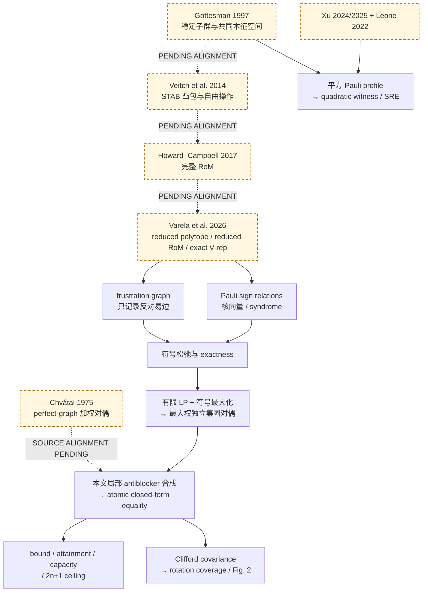

# Stabilizerness：整篇 Claim DAG 与根选择

## 为什么先画整篇 DAG

AgtXIv 的工作顺序是：

```text
整篇论文的原子 claim DAG
  → 选择一个待标准化的目标子图
  → 沿承重边反向追踪外部 imports
  → 为该子图选择 practical roots
  → 构建并验收 Root PaperAgents
  → 正向重建目标论文的局部增量
```

这里的 root 是相对于某个目标 claim 和验证范围的停止点，不是“领域中最早或最著名的论文”。因此，本项目同时保存 stabilizerness 的概念谱系和闭式定理的技术依赖，但不会把前者全部塞进后者的数学证明闭包。

最简单的物理图像是单比特 Bloch 球：±X、±Y、±Z 的六个纯稳定子态是一个八面体的六个顶点，Clifford 操作旋转这些顶点，经典掷硬币式的随机混合填满八面体；球内但八面体外的状态就是 nonstabilizer/magic。多比特时，这个八面体推广成高维稳定子多面体。

少量 Pauli 测量只看到该高维凸体在少数坐标上的“影子”。影子外的点一定来自 magic state，影子内的点则可能只是测量窗口没有看出 magic。Reduced robustness of magic（reduced RoM）量化的是用带正负号的伪概率拼出这个投影点所需的最小一范数代价，不是到多面体的欧氏距离。

## 最小 claim DAG（读者投影）

下图是 [74-node whole-paper audit DAG](dag/claim-dag.json) 的 14-node 读者投影，不替代机器审计图。实线表示论文内部或已显式重建的逻辑使用；虚线表示尚未验收的跨论文 import。两者都不是普通 citation edge，且虚线绝不表示 `accepted=true`。历史和 related-work 引用不画成承重箭头。



主闭式定理的承重主干是 `VR → FG/SR → E → X → F`。这里刻意把反对易图 `FG` 与 Pauli 符号关系 `SR` 画成两个节点：普通无向图不能恢复乘积关系的相位和奇偶约束。Capacity、Clifford、数值结果和 stabilizer Rényi entropy（SRE）是从共享定义分出的独立 branches，不能并入同一个 ClaimContract。

### 两个必须分开的 Varela badges

- Exact V-representation：**`PROOF_GAP` · `THEOREM_NOT_REFUTED` · `CONDITIONAL_REPAIR`**。缺口位于来源证明；目前没有该 theorem 的反例，独立修补尚未完成验收。
- Fixed-window monotonicity：**`FALSE` · `EXPLICIT_COUNTEREXAMPLE`**。这是已被反例推翻的独立 claim，不能隐藏在 V-representation 的 blocker 中。

## 整篇主要 branches

| Branch | 主要原子 claims | 主要外部输入 | 与主闭式的关系 |
|---|---|---|---|
| Free-state semantics | 纯稳定子态、`STAB = conv`、free operations、完整 RoM | Gottesman 1997；Veitch et al. 2014；Howard–Campbell 2017 | 提供物理语义，不自动进入闭式的最小数学闭包 |
| Reduced polytope | 测量投影、reduced RoM、精确 V-representation、一般 membership hardness | Varela et al. 2026 | 直接技术 import |
| Relaxation/exactness | sign-relaxed polytope；active dependency；无 active dependency 当且仅当松弛精确 | V-representation；其余为本文局部推导 | 主干 |
| Graph dual | 自由符号最大化；最大权独立集 separation oracle | 标准有限 LP 强对偶 | 主干 |
| Perfect graph/closed form | weighted stable-set/fractional clique-cover duality；本地 antiblocker 合成；闭式等式 | Chvátal 1975；复杂度另用 Grötschel–Lovász–Schrijver 1981 | 主干终点 |
| Capacity/extremality | clique 二范数约束；`sqrt(clique number)` 上界；attainment；`2n+1` ceiling；Jordan–Wigner witness | 目标论文给出局部 variance、Cauchy–Schwarz 和辛秩证明；Sarkar 2021 仅交叉支持 | 闭式之后的独立 corollaries |
| Clifford | 共轭下坐标 LP 同构；solvability 与 capacity 保持 | 标准 Clifford/stabilizer 语义 | 独立 covariance branch |
| Numerics | 四类 measurement sets；Haar 与 variational ensemble coverage | 无承重论文 import；需要代码、随机规范和 raw data | empirical branch，当前阻塞 |
| Squared profile/SRE | stabilizer optimum 等于 weighted independent-set value；quantum beta；pure/mixed SRE identities | Xu 2024/2025；Leone 2022；Pauli Parseval | 与线性 reduced RoM 平行，不是其推论 |

## 四类“图”必须隔离

| 对象 | 节点 | 边或关系 | 是否有向 | 建议字段名 |
|---|---|---|---|---|
| Scientific claim DAG | 原子 statement / reasoning step | 一个结论实际使用另一个结论 | 有向；多前提时是超边 | `scientific_claim_dependency` |
| Citation graph | 论文 | 文献引用 | 通常有向 | `citation` |
| Frustration graph | Pauli observable | 两个 Pauli 反对易 | 无向普通边 | `anticommutes` |
| Pauli product-dependency structure | Pauli observable | 一组 Pauli 的乘积模相位为恒等 | 超边或二进制核向量；另带 syndrome | `pauli_product_relation` |

Citation 不是 proof dependency。Frustration graph 也看不到 commuting context 内的允许符号；后者由 Pauli product relations 的奇偶约束决定。AgtXIv 的“active dependency”与论文的 Pauli-active dependency 没有概念对应关系。

## 根分类

### Conceptual roots：解释“为什么这是 stabilizerness/magic”

概念阅读和标准化顺序固定为 **Gottesman → Veitch 2014 → Howard–Campbell**：

1. **Gottesman 1997**, *Stabilizer Codes and Quantum Error Correction*, arXiv `quant-ph/9705052`, DOI `10.7907/rzr7-dt72`：稳定子群与共同 \(+1\) 本征空间。
2. **Veitch et al. 2014**, *The Resource Theory of Stabilizer Computation*, arXiv `1307.7171`, DOI `10.1088/1367-2630/16/1/013009`：纯稳定子态、其凸包、自由操作与 magic/free-set 语义。
3. **Howard–Campbell 2017**, *Application of a resource theory for magic states to fault-tolerant quantum computing*, arXiv `1609.07488`, DOI `10.1103/PhysRevLett.118.090501`：\(n\)-qubit RoM 的伪混合一范数定义、faithfulness 和完整资源理论性质。

Veitch et al. 2012 已使用 “stabilizer polytope” 一词，但其主要 Wigner-negativity 结果限制在奇数维系统；它是重要 precursor，不是本 qubit RoM 链的主根。Reichardt 的 arXiv `quant-ph/0608085` 更早写出了单比特八面体及多比特稳定子混合的 convex polyhedron，是几何谱系中的 historical root，但没有承担本文需要的完整 free-set/resource-theory contract。Bravyi–Kitaev 2005 提供 magic-state injection、distillation 和单比特八面体的物理直觉，也应标为 operational precursor，而非一般 `magic = outside STAB` 的定义根。若要正式导出 Gottesman–Knill 经典模拟范围，则另用 Gottesman 1998（arXiv `quant-ph/9807006`）的操作定理，不能让 1997 thesis 自动承担该结论。

本轮已经落盘这三个 conceptual Root PaperAgents；共 5 个原子 exports，当前都必须保持 `accepted=false`：

| Conceptual Root PaperAgent | 当前阶段 | accepted |
|---|---|---|
| Gottesman 1997 | 一般 (r) 个 phase-aware Pauli 生成元的 (2^{n-r}) 共同固定空间、正交/半正定投影，以及 rank-(n) 纯态均已 Lean kernel 检查；source convention 和人类语义复核待完成 | `false` |
| Veitch et al. 2014 | Lean 已构造 semantic Clifford witness，并证明共同本征空间 atoms = Clifford-orbit atoms 及两者凸包相同；operation protocol 与 source/human 语义对齐待完成 | `false` |
| Howard–Campbell 2017 | all-(n) signed feasibility、最优解存在、full RoM faithfulness 和确定性 atom-preserving map 单调性已 Lean kernel 检查；physical protocol→map 与 selective on-average branch 待完成 | `false` |

这里的顺序是**验收/发布门**，不是禁止提前探索的构建门：Veitch、Howard 或技术 Agent 可以先条件性落盘，但不得越过未验收的上游 import 继承 `accepted`，也不得据此发布下游结论。

### Direct theorem roots：目标证明真正导入的结果

- **Varela et al. 2026**, *Predicting Magic from Very Few Measurements*, arXiv `2602.18939`：导出 projected polytope、reduced RoM 的 witness/lower-bound 语义和 exact V-representation。它是直接技术依赖，不是 stabilizerness 的概念根。
- **Chvátal 1975**, *On Certain Polytopes Associated with Graphs*, DOI `10.1016/0095-8956(75)90041-6`：导出 finite perfect graph 上 weighted stable-set/fractional clique-cover duality。目标论文再局部合成所需的 antiblocker identity。
- 若 ClaimContract 包含“多项式时间”，再单独导入 **Grötschel–Lovász–Schrijver 1981**, DOI `10.1007/BF02579273`，并显式限定 rational/finite-precision input encoding。它不属于 exact-real equality 的合同。

### Branch-specific roots

- **Leone–Oliviero–Hamma 2022**, arXiv `2106.12587`, DOI `10.1103/PhysRevLett.128.050402`：pure-state SRE 定义和语义。
- **Xu–Schwonnek–Winter 2024**, arXiv `2308.00753`, DOI `10.1103/PRXQuantum.5.020318`，以及 **Xu et al. 2025**, arXiv `2511.13531`：weighted beta、Pauli graph optimization 与 hbar-perfectness。
- **Sarkar–van den Berg 2021**, arXiv `1909.08123`, DOI `10.1007/s40687-020-00244-1`：最大 commuting/anticommuting Pauli sets。目标论文已局部重证其主文所需的 `2n+1` 界，因此该引用在该节点不是必需 root。

### Standard foundations 与 mere citations

有限 LP 强对偶、Cauchy–Schwarz、variance 非负、有限维 Pauli 辛表示和 Clifford 保持 Pauli 关系，可作为显式 `STANDARD_BACKGROUND_ACCEPTED` foundations；仍需声明相位和有限维约定。

Nielsen–Chuang、Shor、Gottesman–Chuang、García、Heinrich、Karp、Macedo、Chudnovsky、Nation、Zurel、Brauer–Weyl、Howard contextuality 等在当前主闭式子图中是背景、术语、历史、相关工作或解释。除非选择相应 branch claim，不得自动生成 `IMPORTS_RESULT`。

## 优先标准化顺序

1. 冻结整篇 source bundle，并把复合 theorem、figure claim、complexity claim 和 interpretation 拆成原子节点。
2. 建立 whole-paper DAG 和 citation-role 表；这张整篇地图先于任何 root 验收。
3. 构建 **Gottesman 1997** conceptual Root PaperAgent；其承重数学现已 kernel-closed，发布验收仍等待 source/physical-semantics 人类复核。
4. 在 Gottesman contract 上构建 **Veitch et al. 2014** conceptual Root PaperAgent；frame↔orbit 与凸包数学已 kernel-closed，operation semantics 尚未验收。
5. 在 Veitch free-set contract 上构建 **Howard–Campbell 2017** conceptual Root PaperAgent；full-RoM 数学已 kernel-closed，protocol→map 与选择分支语义尚未验收。
6. 可以并行、条件性构建 `atomic closed-form equality` 技术子图，但在三个 conceptual contracts 全部 accepted 之前不得验收或发布其完整物理语义。技术顺序为先审 Varela direct technical dependency，再建 Chvátal perfect-graph Root PaperAgent；算法复杂度另开 Grötschel–Lovász–Schrijver contract。
7. 正向标准化 sign relaxation、exactness、LP/sign maximization、maximum-weight independent set 和 local antiblocker chain。
8. 把 bound、attainment、capacity、`2n+1` ceiling 作为独立 downstream contracts。
9. 再处理 Clifford covariance；coverage 和 Fig. 2 保留为独立 empirical branch。
10. 最后处理 squared-profile/SRE appendix，尤其隔离 pure-state resource statement 与 mixed-state algebraic identity。

## 已知 blockers 与失败 claim

### 1. V-representation 的 source proof gap

Varela source 中“full-rank stabilizer 与测量集之交自动 maximal”的中间断言有反例。V-representation statement 尚未发现反例。现在已经建立独立 Lean 切片，严格检查了测量坐标投影、投影凸体的 top-down 语义，以及“候选点可实现 + 任意投影 atom 可细分 ⇒ 两个凸包相等”的条件推导；但这两个前提和候选点极端性仍是公开义务。因此 root export 只能是 `PARTIALLY_FORMALIZED/PARTIALLY_VERIFIED`，`accepted=false`。Source fidelity 通过不能自动传递成 source derivation 或数学正确性通过。

物理图像是：我们只从几个 Pauli 坐标给完整稳定子凸体拍一张照片。原凸体的一些尖角在照片中会重叠到边或内部；影子的候选尖角来自把一个 inclusion-maximal 的相容测量语境饱和到允许的正负号。Lean 目前已经检查“如果这些候选点确实可实现，而且所有原尖角的照片都能混合成它们，那么影子凸体正是它们的凸包”，但还在继续证明两个“确实”。

### 2. Fixed-window reduced RoM 并非一般 stabilizer monotone

对固定 \(M=\{X,Z\}\)，取 Bloch vector \((1/\sqrt{2},1/\sqrt{2},0)\) 的纯态。初始测量坐标为 \((1/\sqrt{2},0)\)，故 reduced RoM 为 1。自由 Clifford \(R_X(\pi/2)\) 把隐藏的 \(Y\) 分量旋到 \(Z\)，而保持窗口 \(M\) 不动，输出坐标满足 \(|X|+|Z|=\sqrt{2}\)，故 reduced RoM 增至 \(\sqrt{2}\)。

因此 fixed-\(M\) quantity 应标为 **measurement-dependent functional/witness**，不能导出“对任意 stabilizer operation 单调”的合同。仍然成立的是：

- reduced RoM 不超过 full RoM；
- reduced RoM \(>1\) 可认证 magic；
- measurement set 与 state 一起 co-rotate 时的 Clifford covariance。

目标稿 87、122 和 499 行使用 “monotone” 的表述，以及 Varela 对应证明，应记录为独立 `FAILED/COUNTEREXAMPLE_FOUND` 节点。这个失败不破坏 closed-form equality DAG。

### 3. Fig. 2 当前不可复现

现有 bundle 只有 TeX、生成的 `.bbl` 和两张 PDF 图，没有代码、raw data、随机种子、Clifford sampler、旋转角分布、阈值 margin 或数值容差。样本量和电路深度描述不足以产生可审核的 exact reproduction。该 branch 只能标为 `BLOCKED` 或最多 `QUALITATIVE_ONLY`；自建有限例回归不能继承成 Fig. 2 的 `REPRODUCED`。

## 闭式定理技术子图的 root 决议（非全局第一步）

在 Gottesman → Veitch 2014 → Howard–Campbell 三个 conceptual contracts 关闭之后，atomic closed-form equality 技术子图的最小实际闭包为：

```text
Root PaperAgent 1: Varela 2026 exact reduced V-representation
Root PaperAgent 2: Chvátal 1975 weighted perfect-graph duality
Declared external foundation: standard finite LP duality
```

图论根采用显式外部基础策略：Lean 下游定理必须把 perfect-graph 加权对偶作为参数传入；可以内核检查“在该参数下推出的后果”，但不会声明自定义 `axiom`，也不会把 Chvátal 定理本身标成 `KERNEL_CHECKED`。当前 primary-source statement alignment 仍为 `PENDING`。

上述两个 roots 只是 closed-form theorem subgraph 的技术 roots，不能被展示成项目的全局第一步。当前全局门仍是三个 conceptual Root PaperAgents；它们本轮均已落盘但 `accepted=false`，所以 Varela/Chvátal 技术闭包也尚不能成为已接受的最终发布闭包。
