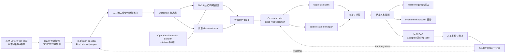

# AgtXIv 轻量级信息抽取与科学依赖 DAG 模型研究

> 状态：方案设计，不代表已经训练或部署模型  
> 仓库审计与网络资料访问日期：2026-08-16  
> 适用范围：从冻结的论文来源生成**可人工复核的候选** `Statement`、`ReasoningStep` 与 claim-level dependency DAG；不得自动把候选提升为科学上已验收的 `ClaimContract`。

## 执行摘要

AgtXIv 当前已经有一个有价值的静态原型：来源冻结、哈希和行锚点，原子 `Statement`，显式多前提 `ReasoningStep`，分轴 `VerificationRecord`，带 blocker 的 `ClaimContract`，以及无环图校验。当前仓库统计为 5 个 Paper Agents、50 个 statements/assumptions、23 个 reasoning steps、21 个 verification records、7 个 ClaimContracts；7 个合同全部 `accepted=false`。`Stabilizerness/dag/claim-dag.json` 有 74 个节点和 129 条边。结构原型可运行，但 scientific information extraction、claim 原子化、citation role 分类、依赖边发现和人工审核队列尚未形成可重放的软件流水线。

**最佳现实方案不是“全文输入、完整 DAG 输出”的单模型，而是四级流水线：**

1. **Claim extraction**：规则和小型 encoder 找出原文 span、分类并辅助原子化；
2. **Candidate retrieval**：BM25、公式/符号匹配和双塔 encoder 高召回检索候选前提；
3. **Edge typing and evidence attribution**：cross-encoder 判断边类型、方向，并同时定位目标文 use span 与来源文 statement span；
4. **DAG assembly**：确定性程序执行 ID、schema、超边、无环、blocker 传播和拒答约束。

推荐 MVP 组合是：本地 LaTeX 结构解析 + OpenAlex/Semantic Scholar 元数据补全 + BM25 和 E5/BGE 类双塔 + 150M--600M cross-encoder + 温度校准 + 确定性 DAG 构图器。GLiNER、NuExtract、XGrammar 等可以作为候选组件，但只有许可证清晰并在 AgtXIv 数据上验证后才能纳入稳定实现。MultiCite 的官方 README 声明 CC BY-NC 2.0，GLiREL 的 README 与 `pyproject.toml` 许可信息相互冲突，Sci-Arg/SAM 的仓库级许可也需逐项核验；这些资源不能默认用于产品化训练。

**最重要的概念边界：引用图不等于科学依赖图。** 论文 A 引用论文 B，只说明存在一次书目引用；citation intent 只说明该引用在语篇中大致用于背景、方法或结果。AgtXIv 所需的边必须连接两个原子 claim，方向为“前提到结论”，并有目标文实际使用该前提的证据，以及来源文确实陈述该前提的证据。

截至 2026-08-16，没有发现许可清晰、维护活跃、可直接完成“全文 → 原子 claim → 双侧证据 → claim-level dependency DAG”的完整开源项目。现有项目只能复用局部能力。因此核心自研部分是：AgtXIv 标注协议、claim--claim dependency gold 数据、双证据边分类、`ReasoningStep` 超边组装、状态传播和审核界面。

---

## 1. 零基础术语表

| 术语 | 简明定义 | 在 AgtXIv 中的作用 |
|---|---|---|
| 文献检索 | 从元数据、全文和引用索引中找到可能相关的论文或段落 | 缩小候选范围，不作科学判断 |
| 实体抽取 | 找出方法、数据集、物理量、材料、模型等名词性对象 | 辅助 claim 理解与召回，不等于抽 claim |
| Claim | 可判断真伪、适用范围明确的原子科学陈述 | `Statement` 的主要来源之一 |
| Claim 原子化 | 把“等式成立且有上界且可达到”拆成三个独立陈述 | 避免一个节点混合不同前提和验证状态 |
| 关系抽取 | 判断两个对象之间是否有某种语义关系 | 用于候选边类型与方向 |
| Citation intent | 一次引用在语篇中的用途，如背景、方法或结果比较 | 只是边分类特征，不是依赖真值 |
| Evidence attribution | 把预测绑定到原文的具体 span | 使预测可追溯、可复核 |
| Claim-level dependency | 结论在实际论证中使用某个定义、前提、结果或数据 | AgtXIv 科学依赖图的边 |
| `ReasoningStep` | 多个输入经过一个可检查操作得到输出 | 原生表示有向超边 |
| DAG | directed acyclic graph，有向无环图 | 表示选定的 prerequisite/depends-on 投影 |
| 溯源 provenance | 来源版本、文件哈希、位置、抽取器版本和审核记录 | 防止来源漂移和不可重放 |
| 置信度 | 模型对其分类判断的概率估计 | 必须校准，不能替代验证状态 |
| 拒答 abstention | 关系不确定时设 `edge_decision=UNKNOWN`；证据缺失时另设 `evidence_status=BLOCKED_MISSING_*` | 比流畅地补全缺失边更安全 |
| Blocker | 阻止某个合同被接受的未解决问题 | 必须向下游传播 |
| Gold 数据 | 经明确协议和人工裁决的高质量标注 | 训练、校准和独立评测的基准 |
| 弱标注 | 规则、现有标签或教师模型产生的候选标签 | 降低冷启动成本，但不能替代 gold |
| LoRA/QLoRA | 只训练少量低秩参数；QLoRA 还量化基础权重 | 降低适配大模型的显存成本 |

### 1.1 三种图的严格区别

设论文集合为 $\mathcal P$，原子 claim 集合为 $\mathcal C$。

1. **引用图**：节点是论文，$p_i\to p_j$ 表示 $p_i$ 引用了 $p_j$。
2. **引用事件/intent 图**：节点或记录围绕某次 citation marker，标签表示背景、方法、结果等用途。
3. **科学依赖图**：节点是 claim，$c_i\to c_j$ 表示 $c_j$ 的实际论证使用 $c_i$。

一个背景引用可能没有承重依赖；一个方法引用可能只依赖其中一个算法定义；一个 claim 也可能依赖未显式引用的标准基础知识。故不能把引用边直接改名为 `scientific_claim_dependency`。

AgtXIv 还必须隔离另外两种领域图：`anticommutes` 的 frustration graph，以及 Pauli product relation 超图。它们都不是科学论证依赖图。参见 `Stabilizerness/DAG_AND_ROOTS.md`。

---

## 2. 当前仓库现状审计

### 2.1 已实现

| 能力 | 证据路径 | 结论 |
|---|---|---|
| 来源冻结、工件哈希、行级锚点 | `agents/*/source/anchors.jsonl`；`tools/validate_pilot.py` | 已实现，当前最成熟的数据层 |
| 原子 statement 静态工件 | `agents/*/knowledge/statements.jsonl` | 已实现，但缺统一 JSON Schema |
| 显式多输入推理步骤 | `agents/*/reasoning/chains.jsonl` | 已实现；适合用作超边 gold seed |
| 分轴验证记录 | `agents/*/verification/records.jsonl` | 已实现静态记录，部分 reviewer 流程不可重放 |
| 合同、imports、blockers 和发布门 | `agents/*/exports/*.json`；`release-manifest.json` | 已实现；7/7 合同均未接受 |
| 纵向 claim 图及无环检查 | `graph/claim-dependencies.json`；`tools/validate_pilot.py` | 已实现 |
| whole-paper 审计图 | `Stabilizerness/dag/claim-dag.json`；`tools/validate_claim_dag.py` | 已实现 74 节点/129 边的审计图 |
| 静态查询 | `tools/query_agent.py` | 已实现，但接受状态递归传播仍有缺口 |
| Lean 核心和有限实例工件 | `formal/AgtXIvRootMath/`；各 agent 的 `verification/` | 有窄范围实现，不覆盖完整物理语义 |

只读审计实际运行结果：

- `python3 tools/validate_pilot.py`：结构校验通过；
- `python3 tools/validate_pilot.py --strict-science`：按设计失败，scientific release gate 为 `BLOCKED`；
- `python3 tools/validate_claim_dag.py --json`：74 节点、129 条边、无结构循环；
- `python3 tools/validate_root_partitions.py`：当前失败，因为两份 Lean 文件的实际哈希与 `formal/AgtXIvRootMath/verification-result.json` 中证据哈希不一致。此项不能报告为绿色。

### 2.2 部分实现

1. **whole-paper DAG 与 Agent 推理图尚未统一。**  
   `Stabilizerness/dag/claim-dag.json` 使用 `claim:closed-form-rom` 等 ID；Agent 工件使用 `statement:2607.26154v1:closed-form-equality`。前者没有统一引用 `ReasoningStep` 与 `SourceAnchor`，二者缺少机器可验证的映射。

2. **只有 Root 五路分区有正式 Schema。**  
   `schemas/root-verification-partition.schema.json` 存在，但 `Statement`、`ReasoningStep`、`SourceAnchor`、`VerificationRecord`、`ClaimContract`、`Blocker` 和 claim DAG 均无正式 schema。

3. **validator 检查结构，不验证科学内容。**  
   它们能查引用完整性、工件哈希和无环性，但不能验证自然语言规范化是否忠实、推理是否数学正确、物理语义是否一致或 reviewer 是否独立。

4. **查询层可能过度提升状态。**  
   `tools/query_agent.py` 的递归 `why` 跟踪较安全，但摘要 basis 判定没有完整递归检查所有上游 accepted 状态。后续实现必须把 accepted-chain 计算改为完整依赖闭包规则。

### 2.3 缺失

- TeX/PDF 到结构化文档的统一解析入口；
- 自动 claim span 候选与复合 claim 原子化；
- citation marker、citation intent 与被引 claim 对齐；
- claim 候选检索、边类型/方向、双侧 evidence span；
- 模型、prompt、规则版本和输入哈希的生成 provenance；
- 人工复核队列、双标、分歧裁决和签名记录；
- 可执行的弱标注、训练、校准和评测脚本；
- whole-paper 图与 Agent 图的单一事实源。

### 2.4 目前依赖大型 LLM 或人工判断的环节

仓库中出现 `multi_agent_source_derivation_review`、`claim_level_semantic_review`、`independent_mathematical_reconstruction_review` 等静态 verification method，以及 `paper_analyst`、`reader-agent`、`multi-agent-review` 等 checker 名称，但没有保存模型版本、prompt、输入哈希、运行日志和分歧裁决。因此它们只能认定为**代码外、当前不可独立重放的 Agent/LLM 判断**。

`coverage.json` 明确记录 human physical-semantic review 为 0。以下事项仍需领域专家判断：source-to-normalized 对齐、数学假设匹配、物理语义、proof gap 与定理真假的区别、外部合同接受，以及最终 `accepted=true`。

---

## 3. 基本原则：从论文到依赖 DAG

### 3.1 文献发现与全文获取

1. 用 DOI、arXiv ID、标题和作者消歧论文身份；
2. 固定具体版本，不以“最新网页内容”代替冻结来源；
3. arXiv 优先使用 LaTeX source；PDF 仅作回退；
4. 保存 artifact hash、section path、行/字符偏移和 content hash；
5. 元数据 API 只负责身份和候选引用，不负责 claim 真值。

### 3.2 Claim 抽取与原子化

模型首先判断一段文本是否包含 definition、assumption、equation、claim、theorem、approximation、numerical result、physical interpretation、limitation 或 counterexample。然后把复合陈述拆为可独立验证的节点。

原文和规范化文本必须分开：

- `text_source`：原文 verbatim span；
- `text_normalized`：保留量词、否定、对象、适用域和 exactness 的规范化表达；
- `origin`：`SOURCE_EXPLICIT`、`AGENT_NORMALIZED`、`AGENT_INFERRED` 等；
- 任何规范化都不能伪装成原文直接陈述。

### 3.3 候选依赖与双证据

对于候选 $A\to B$，必须分别寻找：

- **target-use evidence**：目标论文中实际使用 $A$ 推出、定义或限定 $B$ 的 span；
- **source-statement evidence**：来源论文中确实陈述 $A$ 的 span；
- citation marker 只作辅助证据。

若只有主题相似，应将 `edge_decision` 标为 `NO_EDGE` 或 `UNKNOWN`；若缺少任一侧证据，则另将 `evidence_status` 标为相应 `BLOCKED_MISSING_*`。两种状态不能混为一个标签。

### 3.4 有向超图与 DAG 投影

推理通常是“$A$ 与 $B$ 联合推出 $C$”，不是两条独立的 $A\to C$、$B\to C$。因此事实源应是 `ReasoningStep(inputs, outputs)`；普通二元边只是为查询生成的 incidence 索引。

并非所有科学关系都天然无环。`CONTRADICTS`、`COMPARES_WITH`、`SAME_AS`、版本替代等关系应存于独立关系层。只有 `prerequisite/depends-on` 投影强制为 DAG。若发现环，应报告 cycle 和冲突原因，不得静默删除最低分边。

### 3.5 置信度、验证状态与人工复核

模型置信度只表示模型的不确定性，不能替代：

- `SOURCE_ALIGNMENT`；
- `LEAN_KERNEL`；
- `EXACT_PHYSICAL_SEMANTICS`；
- `PHYSICAL_APPROXIMATION`；
- `EMPIRICAL`。

预测达到高阈值，也只能成为 candidate。`accepted=true` 必须由确定性门和授权审核产生。中间置信区间令 `edge_decision=UNKNOWN` 并进入人工队列；证据缺失则独立设置 `evidence_status=BLOCKED_MISSING_TARGET_USE` 或 `BLOCKED_MISSING_SOURCE_STATEMENT`。

---

## 4. 文献与数据集地图

下表只说明“可支持哪个子任务”，不表示可直接转成 AgtXIv 的依赖 gold。

| 资源 | 稳定标识 | 可支持的子任务 | 关键限制 |
|---|---|---|---|
| SciERC | Luan et al., 2018；DOI `10.18653/v1/D18-1360`；arXiv `1808.09602` | 科学实体、关系、共指的暖启动 | 摘要级实体关系，不是 claim dependency；原独立官方仓库已不可用 |
| SciREX | Jain et al., 2020；DOI `10.18653/v1/2020.acl-main.670`；arXiv `2005.00512` | 全文、共指、文档级 $n$ 元关系 | schema 是 task--dataset--method--metric，不是任意 claim 边 |
| DocRED | Yao et al., 2019；DOI `10.18653/v1/P19-1074`；arXiv `1906.06127` | 文档级 RE、跨句关系基线 | Wikipedia 领域，关系 schema 不匹配 |
| Re-DocRED | Tan et al., 2022；arXiv `2205.12696` | 假阴性与文档级 RE 评测设计 | 仍非科学 claim；许可需逐文件核对 |
| SciCite | Cohan et al., 2019；DOI `10.18653/v1/N19-1361`；arXiv `1904.01608` | 粗粒度 citation intent | 三类引用用途，不定位被依赖 claim |
| MultiCite | Lauscher et al., 2022；DOI `10.18653/v1/2022.naacl-main.137`；arXiv `2107.00414` | 多句、多标签 citation intent | 仍是引用事件；官方 README 声明 CC BY-NC 2.0，并依赖 S2ORC 使用条件，不可默认用于商业训练或再分发 |
| SciFact | Wadden et al., 2020；DOI `10.18653/v1/2020.emnlp-main.609`；arXiv `2004.14974` | claim 检索、evidence selection、支持/反驳 | claim 多为人工改写；不是论文内 claim--claim 依赖 |
| Sci-Arg corpus | Lauscher, Glavaš & Ponzetto, 2018；*An Argument-Annotated Corpus of Scientific Publications*；DOI `10.18653/v1/W18-5206` | 科学 claim、evidence 与 argument relation | 规模和领域有限；argument relation 不是 AgtXIv dependency gold |
| SAM | Binder, Verma & Hennig, 2022；*Full-Text Argumentation Mining on Scientific Publications*；DOI `10.18653/v1/2022.wiesp-1.7`；arXiv `2210.13084` | 全文科学论证挖掘 | 官方实现为 `DFKI-NLP/sam`；仓库级许可证未明确，复用前需核验 |
| Evidence Inference | Lehman et al., 2019；DOI `10.18653/v1/N19-1371` | 医学 evidence span 与方向性结论 | 限定临床 PICO，全文许可继承 PMC 来源 |
| S2ORC | Lo et al., 2020；DOI `10.18653/v1/2020.acl-main.447`；arXiv `1911.02782` | 科研全文、引用解析、语料索引 | 旧仓库转向数据/API 产品；数据与原文许可分开 |
| unarXive 2022 | Saier et al., 2023；arXiv `2303.14957` | 保留结构、公式和引用的 arXiv 全文 | 2022 快照非实时全量；单篇原文许可仍生效 |
| ORKG | Brack et al., 2021；*ORKG: Facilitating the Transfer of Research Results with the Open Research Knowledge Graph*；DOI `10.3897/rio.7.e68513` | ontology、provenance、科研比较结构 | 多为人工/半自动知识图，不是现成 claim extractor |
| REBEL | Huguet Cabot & Navigli, 2021；DOI `10.18653/v1/2021.findings-emnlp.204`；arXiv `2104.08675` | 生成式三元组抽取基线 | 通用 KB 关系；生成幻觉与 span grounding 风险 |
| GenIE | Josifoski et al., 2022；arXiv `2112.08340` | 受约束生成式 IE 设计 | 面向预定义实体/关系集合，环境较旧 |
| LoRA | Hu et al., 2021；arXiv `2106.09685` | 低成本领域适配 | 不解决 gold 缺失与事实性 |
| QLoRA | Dettmers et al., 2023；arXiv `2305.14314` | 4-bit 条件下适配 1B--7B 模型 | 节省训练显存，不等于推理必然更快 |
| DistilBERT / TinyBERT / MiniLM | arXiv `1910.01108` / `1909.10351` / `2002.10957` | encoder 蒸馏、低延迟部署 | 长文与复杂跨段推理能力有限 |

### 4.1 元数据与全文底座

- **OpenAlex**：官方文档 `https://docs.openalex.org/`；核心数据以 CC0 提供；适合 works、DOI/arXiv ID、作者和引用边，不提供足够的全文 claim context。
- **Semantic Scholar API / Academic Graph**：`https://api.semanticscholar.org/`；适合论文身份、reference/citation 交叉核验和按需数据；使用时遵守当期 API 与 dataset 许可。
- **unarXive**：官方仓库 `IllDepence/unarXive`，代码 MIT；适合 arXiv 结构化全文补充。
- **S2ORC**：官方旧仓库 `allenai/s2orc`，数据许可说明为 ODC-By 1.0；2020 论文中的规模数字不能当作 2026 当前规模。

MVP 不应下载上述全量快照。应按当前 12--25 篇论文的稳定 ID 获取最小样本。

---

## 5. 官方开源项目比较

维护状态按 2026-08-16 实际核验的官方仓库信息记录；“可运行级别”只表示仓库材料完整度，不表示已在本项目环境复现。

| 项目/官方仓库 | 许可与维护核验 | 可运行级别 | 可复用部分 | AgtXIv 结论 |
|---|---|---:|---|---|
| `allenai/SciREX` | Apache-2.0；未归档；最后 push 2024-07-25 | B | 全文科学 IE、共指、文档级关系 | 可作辅助预训练；不可直接输出依赖 DAG |
| `thunlp/DocRED` | MIT；最后 push 2020-12-01 | B | 文档级 RE 基准 | 只作通用跨句基线 |
| `allenai/scicite` | Apache-2.0；最后 push 2019-12-01 | B | citation intent | 可作特征；不可作 dependency 标签 |
| `allenai/multicite` | 数据、代码、模型链接；最后 push 2022-05-10；README 声明 CC BY-NC 2.0，GitHub 未检测到独立 LICENSE 文件 | B | 多句引用语境 | 受非商业与 S2ORC 衍生条件约束；产品化前法律复核 |
| `allenai/scifact` | 数据与 baseline 完整；最后 push 2023-10-15；GitHub 许可 `NOASSERTION` | B | claim/evidence retrieval | 许可确认后作辅助任务 |
| `IllDepence/unarXive` | 代码 MIT；最后 push 2024-09-28 | A/B | 结构化 arXiv 全文 | 全文补充首选之一 |
| `urchade/GLiNER` | Apache-2.0；最后 push 2026-08-10 | A | 开放标签 span 抽取 | 可作为 claim/evidence span 候选；需领域微调 |
| `jackboyla/GLiREL` | 包和模型可用；最后 push 2026-03-30；README 声明 CC BY-NC-SA 4.0，而 `pyproject.toml` 标为 Apache-2.0，GitHub 未识别仓库许可证 | A（技术） | 开放关系分类 | 许可冲突澄清前仅作隔离实验；稳定版优先自建 cross-encoder |
| `numindai/nuextract` | 代码 MIT；最后 push 2026-05-20；权重许可逐模型卡核验 | A | schema 驱动结构化抽取、teacher | 适合弱标注/草案，不作科学真值器 |
| `mlc-ai/xgrammar` | Apache-2.0；最后 push 2026-08-15 | A | JSON Schema/EBNF 约束解码 | 只保证语法，不能保证证据与无环 |
| `huggingface/peft` | Apache-2.0；最后 push 2026-08-14 | A | LoRA/QLoRA 训练层 | 推荐的参数高效微调实现 |
| `DFKI-NLP/sam` | 最后 push 2022-10-26；仓库级许可证未确认 | C | 科学论证关系样例 | 适合 schema 参考，复用前先解决许可 |
| ORKG 官方组织 | 多仓库持续维护、许可证逐仓库不同 | A/B | ontology、API、provenance | 输出设计参考，不是端到端 extractor |

**没有“完整项目首选”。** 若只选可直接复用的组件：

- 全文结构：本地 LaTeX 解析，unarXive 作补充；
- 元数据：OpenAlex，Semantic Scholar 交叉核验；
- span baseline：GLiNER 或自建 token/span classifier；
- 依赖边：自建 cross-encoder 为首选，GLiREL 仅在许可确认后作备选；
- 约束序列化：普通 schema validator 已足够；使用生成模型时再引入 XGrammar；
- 训练：Hugging Face PEFT。

---

## 6. 五条技术路线比较

| 路线 | 优点 | 局限 | 推荐角色 |
|---|---|---|---|
| 规则/检索 + LLM 弱标注 | 冷启动快、证据可展示、无需先有大量 gold | 教师偏差和幻觉；prompt 漂移 | 立即采用，用于候选与弱标签 |
| Encoder 分类器 / 双塔召回 | 轻量、吞吐高、embedding 可缓存 | 细粒度假设与方向判断不足 | 候选检索主力 |
| Cross-encoder 边分类 | 能联合比较两个 claim、上下文和证据 | 计算较贵，需先剪枝 | 边类型、方向和 evidence 主力 |
| Seq2seq / 小语言模型结构化生成 | 原子化、规范化和 schema 草案灵活 | 容易补写不存在的信息，校准较差 | 受约束辅助，不决定 acceptance |
| GNN / Graph Transformer | 可利用邻域和全局结构重排 | 当前只有少量图，极易过拟合和传播错误 | 50--100 张独立 gold 图后再试 |

### 6.1 为什么不从“全文到完整 DAG”开始

1. 当前只有一张 74 节点 whole-paper 图和几十个 Agent 对象，监督远远不够；
2. 长文、跨论文来源、公式和引用同时输入，计算和标注成本高；
3. 同一 DAG 有多种序列化顺序，自回归损失与图正确性不一致；
4. 错误无法定位为漏 claim、漏召回、错边、错方向或构图失败；
5. 生成模型不能可靠保证 evidence span、ID 完整、无环和 blocker 传播；
6. 单模型倾向补全，而 AgtXIv 要求显式不完整优于“看起来完整”；
7. 来源版本变化应局部重算，不应整图重新生成；
8. 五路验证状态不能压成一个生成置信度。

---

## 7. 推荐架构



### 7.1 四个模块的职责边界

- **Claim extraction**：只产生节点候选和 source span；
- **Candidate retrieval**：只保证高召回，不判定真边；
- **Edge classifier**：输出类型、方向、双 evidence 和 calibrated confidence；
- **Assembler**：只执行结构约束，不创造新科学关系。

---

## 8. 数据模型与标注协议

### 8.1 节点类型

优先兼容 `AgtXIv.md`：

- `definition`
- `assumption`
- `convention`
- `equation`
- `claim`
- `theorem`
- `approximation`
- `numerical_result`
- `physical_interpretation`
- `limitation`

再纳入仓库已经实际使用的 `lemma`、`proposition`、`counterexample`、`open_problem`、`bridge_theorem_candidate`。枚举扩展必须版本化。

### 8.2 边类型

与 `Stabilizerness/dag/claim-dag.json` 对齐：

- `scientific_claim_dependency`：证明或论证实际使用；
- `definition_dependency`：使用某定义或对象约定；
- `scope_dependency`：适用域、假设或排除项限定；
- `data_dependency`：经验结论依赖数据、图表或计算协议。

`citation`、`CONTRADICTS`、`SAME_AS`、`SUPERSEDES` 不进入 prerequisite DAG，保存为独立关系记录。

### 8.3 候选判定标签

三个正交字段不得混用：

- `edge_decision`：四类正边、`NO_EDGE`、`UNKNOWN`、`DIRECTION_UNRESOLVED` 或 `VERSION_MISMATCH`；
- `evidence_status`：`COMPLETE`、`BLOCKED_MISSING_TARGET_USE`、`BLOCKED_MISSING_SOURCE_STATEMENT` 或 `UNREVIEWED`；
- `upstream_claim_status`：`ACCEPTED`、`BLOCKED`、`DISPUTED`、`REFUTED` 或 `UNREVIEWED`。

证据缺失、来源 claim 被阻塞和依赖边是否存在是三个不同问题。`UNKNOWN` 与所有 `BLOCKED_*` 状态**都不是负例**。未审查的随机 pair 也不能自动成为负例。

### 8.4 负例层次

1. 跨主题容易负例；
2. 同论文相邻但无逻辑使用；
3. 语义近似、只是比较或复述；
4. 有 citation 但只是背景/历史；
5. gold 边反向；
6. 同一 step 的兄弟前提；
7. 旧版本 statement；
8. capacity、state-specific value 与 empirical coverage 等易混淆对象。

### 8.5 来源、方向与证据

- 边统一保存 `PREMISE_TO_CONCLUSION`；
- 每个节点记录 `paper_id`、artifact、artifact hash、anchor、字符/行范围和 text hash；
- 跨论文正边必须同时有 `target_use_evidence` 与 `source_statement_evidence`；
- 同论文边至少有推理/使用 span；
- 证据不完整时即使分类概率高，也把 `evidence_status` 设为相应 `BLOCKED_MISSING_*`，并禁止该边进入自动候选 DAG；这不等同于上游 claim 的科学状态为 `BLOCKED`。

### 8.6 置信度与状态

保存：

- `confidence_raw`：模型原始分数；
- `confidence_calibrated`：在 held-out dev 上校准后的概率；
- `edge_decision`：依赖类型、`NO_EDGE`、`UNKNOWN` 等；
- `evidence_status`：双侧证据完整性；
- `upstream_claim_status`：来源 claim 的科学状态；
- `annotation_state`：`PROVISIONAL`、`WEAK`、`SILVER`、`GOLD` 或 `ADJUDICATED`；
- `candidate_lifecycle_status`、`accepted` 和五路 verification 继续独立保存。

不要生成 `LOCAL_SOURCE_DERIVATION_CHECKED_WITH_BLOCKED_IMPORTS` 一类组合状态作为唯一字段；展示层可从正交状态计算说明文字。

### 8.7 DAG 冲突与阻塞

发现环时保存：cycle member、边分数、证据、可能的 definition equivalence、版本倒置或方向冲突。人工裁决前状态为 `UNRESOLVED_CYCLE`。任何 blocked 输入都不能自动产生 accepted 输出；判假 claim 必须与“proof gap 但 theorem 未被反驳”严格区分。

### 8.8 与现有对象对齐

| 新标注字段 | 现有对象 |
|---|---|
| source span 与 hash | `SourceAnchor` |
| 原文与规范化 claim | `Statement.text` + 建议新增 sidecar 字段 |
| 多前提与操作 | `ReasoningStep.inputs/outputs/operation` |
| 双侧 evidence 与模型运行 | `VerificationRecord` 或 extraction provenance sidecar |
| 可导出结论、假设、blocker | `ClaimContract` |
| 论文、版本和工件布局 | `PaperAgentManifest` |

短期应使用 sidecar schema，不修改现有核心工件；稳定后再迁移到正式版本化 schema。

### 8.9 最小 JSONL 样例

以下三行分别是节点、候选边和超边。为便于展示进行了换行；实际 JSONL 每个对象占一行。

```json
{"record_type":"statement_candidate","schema_version":"0.1.0","id":"statement:example:main-bound","paper_id":"arxiv:xxxx.xxxxxv1","kind":"theorem","text_source":"For every finite N and every x in D, if A1 and A2 hold, then F_N(x) is at most B_N.","text_normalized":"For all finite N and x in D, assumptions A1 and A2 imply F_N(x) <= B_N.","origin":"SOURCE_EXPLICIT","source_anchors":["anchor:example:main-bound"],"logical_features":{"exactness":"EXACT","negation":false,"validity_regime":["finite N","x in D"]},"annotation_state":"PROVISIONAL","extractor":{"type":"human_seed","version":"protocol-0.1"}}
{"record_type":"dependency_candidate","schema_version":"0.1.0","id":"edge:example:lemma--main-bound","source_node":"statement:example:supporting-lemma","target_node":"statement:example:main-bound","direction":"PREMISE_TO_CONCLUSION","edge_type":"scientific_claim_dependency","edge_decision":"DEPENDENCY_PRESENT","evidence_status":"COMPLETE","target_use_evidence":["anchor:example:target-use"],"source_statement_evidence":["anchor:example:supporting-lemma"],"citation_marker_evidence":["anchor:example:citation-context"],"confidence_raw":0.91,"confidence_calibrated":0.78,"upstream_claim_status":"BLOCKED","candidate_lifecycle_status":"BLOCKED_BY_ROOT_CONTRACT","accepted":false,"blocker_ids":["blocker:example:source-proof-gap"],"annotation_state":"ADJUDICATED","provenance":{"model":"edge-model-0.1","prompt_hash":null,"annotator":"human-review"}}
{"record_type":"reasoning_step_candidate","schema_version":"0.1.0","id":"step:example:weighted-duality","grouping_status":"HUMAN_CONFIRMED","inputs":["statement:example:graph-dual","statement:foundation:perfect-graph-weighted-duality"],"outputs":["statement:example:closed-form"],"operation":"theorem_application","active_assumptions":["assumption:example:perfect-graph"],"input_incidences":[{"node":"statement:example:graph-dual","role":"LOCAL_RESULT"},{"node":"statement:foundation:perfect-graph-weighted-duality","role":"IMPORTED_THEOREM"}],"evidence":["anchor:example:derivation-span"],"status":"UNKNOWN","confidence_calibrated":0.64}
```

---

## 9. 数据生产方案

### 9.1 四层数据

1. **仓库 seed**：50 statements、23 steps、7 contracts、74-node whole-paper 图、blockers 与 source anchors。用途是协议、回归和高难负例，不足以独立训练。
2. **公开辅助任务**：SciERC/SciREX/DocRED 用于 span、共指和文档 RE；SciCite/MultiCite 用于 citation intent；SciFact/Evidence Inference 用于 evidence；Sci-Arg 用于 argument relation。统一映射时不得把原标签当作 AgtXIv dependency gold。
3. **教师弱标注**：教师只对检索出的候选给出节点拆分、边类型、方向和 span 草案；保存模型、版本、prompt/rule hash、输入 artifact hash 和时间。
4. **人工 gold**：双人独立标注 dev/test；训练集至少 20% 双标；第三人裁决。

### 9.2 MVP 数据量

- 12--25 篇论文；
- 300--600 个原子 claims；
- 200--500 条正依赖边；
- 1,500--3,000 条审查后的负例、unknown 和 blocked；
- 400--1,000 组双侧 evidence spans；
- 5,000--30,000 个弱标注候选 pair，仅保留证据可定位者。

进入 GNN 阶段前，建议至少有 50--100 个相对独立的 paper/branch graphs、2,000--5,000 个 gold nodes 和 1,500--4,000 条 gold positive edges。

### 9.3 去泄漏划分

- 同一论文的 arXiv 版本、会议版、期刊版按 canonical work family 同组；
- 同一 Paper Agent 的节点、边、steps、contracts 不跨 split；
- theorem 的摘要复述、附录重述和近重复版本同组；
- 按 paper-held-out、lineage-held-out、temporal-held-out 三种方式评测；
- 测试来源可以进入只读检索索引，但其 gold target-source 边不得参加训练；
- 记录基础模型可能已见过公开论文，不能无证据声称“完全未见”。

---

## 10. 可执行训练方案

### 10.1 Claim extraction

候选模型：

- SciBERT，约 110M，科学文本基线；
- ModernBERT-base，约 149M；
- DeBERTa-v3-base，约 184M；
- GLiNER 作为开放标签 span baseline。

任务包括 token/span 边界、kind、origin 和 atomicity。建议联合损失：

$$
\mathcal L_{claim}=\lambda_s\mathcal L_{span}+\lambda_k\mathcal L_{kind}+\lambda_o\mathcal L_{origin}+\lambda_a\mathcal L_{atomicity}.
$$

量词、否定、exactness 和 scope 需单独评测，不能只看 span F1。

### 10.2 Candidate retrieval

基线顺序：

1. BM25；
2. 符号、公式 token、section 和 citation-neighborhood 特征；
3. E5-base/large、BGE 类 embedding 或 SPECTER2 paper-level 先验；
4. reciprocal rank fusion；
5. 用 gold edge 做 in-batch contrastive 微调。

$$
\mathcal L_{retrieval}=-\log\frac{\exp(s(q,p^+)/\tau)}{\exp(s(q,p^+)/\tau)+\sum_j\exp(s(q,p_j^-)/\tau)}.
$$

MVP 先追求 Recall@20；未被召回的 gold premise 无法由下游恢复。

### 10.3 Edge typing 与 evidence

候选模型：DeBERTa/ModernBERT pair classifier，或 150M--600M reranker。输入包含：

- target claim 与局部推理上下文；
- source claim 与来源上下文；
- citation intent 作为特征；
- 公式/符号、版本和时间特征。

多任务损失：

$$
\mathcal L_{edge}=\mathcal L_{type}+\lambda_d\mathcal L_{direction}+\lambda_t\mathcal L_{target\ span}+\lambda_s\mathcal L_{source\ span}+\lambda_u\mathcal L_{abstention}.
$$

Hard negatives 包括 citation-only、反向边、同术语不同 claim、兄弟前提、旧版本、scope mismatch 和 capacity/coverage 混淆。`UNKNOWN` 和各类 blocked 状态不参与负例挖掘。

### 10.4 ReasoningStep 分组与角色标注

Pairwise 边不能单独决定 $\{A,B\}\Rightarrow C$ 是否为一个联合推理步骤。Gold 数据必须为每个 input incidence 保存 `step_id`、`input_role`、`operation`、`active_assumptions` 和 derivation evidence。MVP 小数据阶段采用规则提出 grouping、人工确认的方案；只有积累足够标注后才训练 pair-to-step grouping 模型。`UNKNOWN` grouping 不自动合并，assembler 只物化已确认的 `step_id + input incidences`，不得因多个 pair 共享 target 就猜出超边。评测报告 step exact match、input-set F1、operation macro-F1 和 orphan-incidence 数。

### 10.5 结构化生成模型

可比较 FLAN-T5-base/large、Qwen 1.5B--3B 或 NuExtract 类模型，只用于：

- 复合 claim 拆分草案；
- 规范化草案；
- JSON sidecar 草案；
- 困难样本教师标注。

使用 JSON Schema/constrained decoding；所有生成字段必须做 substring/span grounding 和确定性检查。7B 只在确有收益时用 4-bit QLoRA，不作为 MVP 默认组件。

### 10.6 LoRA/QLoRA

- 100M--400M encoder 通常直接全量微调更简单；
- 250M--3B seq2seq/LM 可试 LoRA rank 8/16/32；
- 单张 16--24GB GPU 上的 1.5B--7B 可用 NF4 4-bit、bf16 compute 的 QLoRA；
- adapter 选择依据是 held-out evidence、precision、calibration 和 schema validity，不是参数越多越好。

### 10.7 校准与拒答

- 在 paper-held-out dev 上做 temperature scaling；
- 按边类型分别报告 ECE、Brier score 和 reliability bins；
- 高于 $t_{\mathrm{candidate}}$ 进入候选审核队列，低于 $t_{\mathrm{noedge}}$ 标 `NO_EDGE`，中间标 `UNKNOWN`；这些阈值不改变 `ClaimContract.accepted`；
- evidence 不完整时独立设置相应 `evidence_status=BLOCKED_MISSING_*`，不改写 `edge_decision` 或上游科学状态；
- 阈值只在 dev 上确定。

### 10.8 DAG 后处理

硬约束：ID/anchor 存在、无 self-loop、方向一致、跨论文双证据、step incidence 完整、blocked 不提升、`accepted=true` 不由模型设置、不同图类型隔离、schema 合法。

小图可按分数贪心加边并做增量 cycle check；需要全局优化时再使用 ILP/maximum-weight acyclic subgraph。保存约束前后结果和每条被降级边的原因。

### 10.9 硬件档位

| 档位 | 配置 | 能做什么 |
|---|---|---|
| CPU-only | 8--16 核、32GB RAM | 解析、BM25、规则、构图、embedding 推理 |
| 入门 | 12--16GB VRAM | 100M--300M encoder，小 batch cross-encoder，1.5B QLoRA |
| 推荐 MVP | 24GB VRAM、64GB RAM | 300M--600M retriever/reranker，3B QLoRA |
| 舒适 | 48GB 或 2×24GB VRAM | 7B QLoRA、长上下文和更多 hard-negative sweep |
| 80GB | 非 MVP 必需 | 大 batch 或 7B 长上下文实验 |

---

## 11. 评测与消融

### 11.1 指标

**Claim extraction**：exact/overlap span F1、kind macro-F1、atomicity、量词/否定/exactness 保真、load-bearing claim recall、anchor validity。

**Retrieval**：Recall@5/10/20/50、MRR、oracle coverage、same-paper/cross-paper/citation-only 子集。

**Edge/evidence**：edge precision/recall/F1、四类 macro-F1、方向准确率、双 evidence token F1、unknown/blocked recall、ECE、Brier，以及 citation-only 子集的 dependency false-positive rate、`NO_EDGE` 比例和 `UNKNOWN` 比例。

**DAG**：node/typed-edge F1、transitive reduction 后 edge F1、cycle 数、dangling ID、schema validity、load-bearing premise coverage、blocker 传播正确率、ReasoningStep input-set F1。

**人工可用性**：每条边复核时间、每篇节省时间、top-k 有效候选率、未提示关键依赖数、高置信误导错误数。

### 11.2 MVP 项目门槛

这些是未来验收目标，不是已有成绩：

- schema 和 anchor validity：100%；
- 静默 cycle：0；
- retrieval Recall@20：至少 0.85；
- high-confidence scientific dependency precision：至少 0.85；
- citation-only 子集的 dependency false-positive rate：不高于 0.10，并分别报告 `NO_EDGE` 与 `UNKNOWN` 比例；
- unknown/blocked recall：至少 0.80；
- ECE：不高于 0.10；
- load-bearing premise coverage：至少 0.90；
- 自动生成合同全部保持 `accepted=false`。

小样本同时报告 bootstrap 置信区间。

### 11.3 必做消融

- BM25 vs dense vs hybrid；
- 去掉 citation intent；
- 把 citation intent 错当标签的反例；
- 去掉公式/符号特征；
- 双塔直接分类 vs cross-encoder；
- 去掉任一侧 evidence head；
- random vs hard negatives；
- weak only vs gold only vs combined；
- 无校准 vs temperature scaling；
- 无 abstention vs unknown/blocked；
- 无图约束 vs constrained DAG；
- 二元边 vs 显式 `ReasoningStep`；
- 受约束生成 vs 判别式 encoder；
- 数据足够后再比较 GNN reranking。

---

## 12. MVP 到稳定版里程碑

### 阶段 0：协议冻结

输出版本化 sidecar schema、标注手册、paper/version grouping 和 reviewer 流程。停止条件：标注者仍无法稳定区分 citation 与 dependency 时，不进入训练。

### 阶段 1：规则与人工基线

对现有仓库和 5--10 篇新增论文形成 150--250 个初始 gold claims、100--200 条正边和分层负例。停止条件：所有对象必须回指冻结 anchor。

### 阶段 2：claim 与 retrieval MVP

规则 + SciBERT/ModernBERT span baseline；BM25 + dense hybrid。停止条件：oracle candidate pool 漏掉超过 10% gold premise 时先修解析/索引。

### 阶段 3：edge + evidence MVP

cross-encoder、多任务 evidence、hard negatives、校准拒答。停止条件：没有双 evidence 仍大量输出高置信正边时，只保留候选排序，不进入自动构图。

### 阶段 4：DAG assembler

生成 `ReasoningStep` 超边、cycle/conflict/blocker 报告和 schema 合法候选图。任何判假 claim 被提升为 accepted premise，立即阻断发布。

### 阶段 5：稳定版

扩大到 300--600 claims、200--500 正边和 1,500--3,000 审查样本；加入 paper-/lineage-held-out、主动学习、模型卡和 reviewer UI。只有跨未见论文保持性能并减少人工时间，才进入持续运行。

### 阶段 6：图模型研究版

达到 50--100 张独立 gold 图后，比较 GraphSAGE/GAT/小型 graph transformer 对候选边重排的增益。若不能改善 high-confidence precision、blocked recall 或人工时间，停止 GNN 路线。

---

## 13. 主要风险

| 风险 | 后果 | 缓解 |
|---|---|---|
| citation 被当依赖 | 大量看似合理的假边 | 双证据、citation-only hard negatives |
| 教师模型幻觉 | 弱标签污染 | 强制 span grounding、保留 prompt/model provenance |
| 未审查 pair 当负例 | 假阴性训练 | unknown/blocked 独立标签、分层人工抽检 |
| 版本泄漏 | 测试虚高 | canonical work family 分组 |
| 公式被文本 encoder 破坏 | 方向和范围误判 | 保留 TeX、symbol features、原文 hash |
| DAG 约束掩盖模型错误 | 图合法但科学错误 | 保存约束前后结果，不静默删边 |
| blocker 与 refutation 混淆 | 伪造科学结论 | 独立 truth/status 字段与人工裁决 |
| 许可不清 | 无法合法复用 | 每个数据集、代码、权重分别核验 |
| 小样本过拟合 | 只会当前 Stabilizerness 图 | paper/lineage held-out，限制参数量 |
| 单一置信度替代验证 | 伪验收 | 模型分数与五路验证永久分离 |

---

## 14. 明确结论

1. **首选现实架构**：规则与人工 gold → BM25+dense 高召回 → cross-encoder 边分类和双 evidence → 校准拒答 → 确定性 `ReasoningStep`/DAG 组装。
2. **最先训练的组件**应是 claim span/kind 小模型和 candidate-pair cross-encoder，不是完整 DAG 生成模型。
3. **现有完整项目不可直接复用。** 最接近的公开资源分别只覆盖 span、文档 RE、citation intent、evidence 或结构化生成；AgtXIv 的 claim dependency ontology、gold 和状态约束仍需自研。
4. **当前仓库是高价值 seed 和回归集，不是足量训练集。** 先形成 300--600 个 gold claims 与 200--500 条正边，再判断模型收益。
5. **引用图不等于科学依赖图。** citation intent 永远只作候选和特征。
6. **输出必须保持可追溯和可拒答。** 没有双 evidence、存在 blocker 或方向不确定时，不得用图约束强行补全。
7. **任何模型均无权设置 `accepted=true`。** 科学验收继续由来源、数学、物理语义、近似和经验验证的独立门控制。

---

## 15. 来源与访问说明

所有网络来源访问于 2026-08-16。优先依据论文原文、ACL Anthology/arXiv 稳定标识、官方项目文档和官方 GitHub 仓库。关键入口：

- SciERC：`https://aclanthology.org/D18-1360/`
- SciREX：`https://aclanthology.org/2020.acl-main.670/`；`https://github.com/allenai/SciREX`
- DocRED：`https://aclanthology.org/P19-1074/`；`https://github.com/thunlp/DocRED`
- SciCite：`https://aclanthology.org/N19-1361/`；`https://github.com/allenai/scicite`
- MultiCite：`https://aclanthology.org/2022.naacl-main.137/`；`https://github.com/allenai/multicite`
- SciFact：`https://aclanthology.org/2020.emnlp-main.609/`；`https://github.com/allenai/scifact`
- Sci-Arg corpus：`https://aclanthology.org/W18-5206/`
- SAM：`https://aclanthology.org/2022.wiesp-1.7/`；`https://github.com/DFKI-NLP/sam`
- SciREX/S2ORC：`https://github.com/allenai/SciREX`；`https://github.com/allenai/s2orc`
- unarXive：`https://github.com/IllDepence/unarXive`
- OpenAlex：`https://docs.openalex.org/`
- Semantic Scholar API：`https://api.semanticscholar.org/`
- ORKG：`https://orkg.org/`；`https://github.com/orkg`
- GLiNER：`https://github.com/urchade/GLiNER`
- GLiREL：`https://github.com/jackboyla/GLiREL`
- NuExtract：`https://github.com/numindai/nuextract`
- XGrammar：`https://github.com/mlc-ai/xgrammar`
- PEFT：`https://github.com/huggingface/peft`
- LoRA：arXiv `2106.09685`
- QLoRA：arXiv `2305.14314`；`https://github.com/artidoro/qlora`

许可证结论只针对核验到的具体代码仓库或数据说明；代码、模型权重、数据集和论文全文的许可证必须分别处理。未确认许可证的资源不得因“GitHub 可见”而默认可用于再分发或商业训练。
