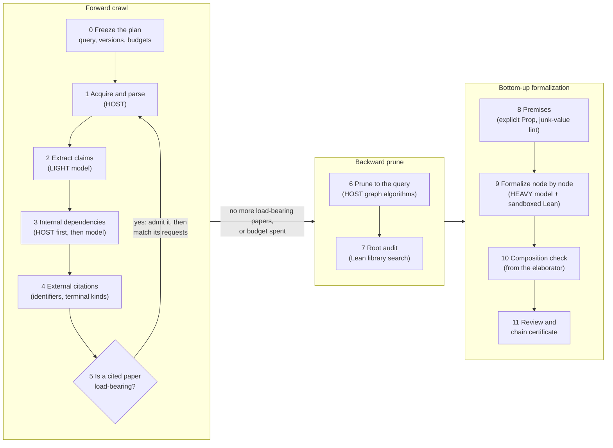

# How schema v0.3 works

Schema v0.3 (`research/0.3.0`) is the third rung of AgtXIv's *schema contract ladder*, which is numbered separately
from the older AgtXIv protocol versions. It is a research framework that starts from one arXiv paper and one of its
claims, follows that claim's dependencies through the papers it relies on, and then tries to formalize the resulting
branch in Lean 4 from the bottom up.

This page explains the intended workflow, its implementation, and the evidence still needed to connect its stages.
Start with [GETTING_STARTED.md](GETTING_STARTED.md) for source-checkout prerequisites and bounded opt-in commands,
and the [English progress review](../docs/releases/schema-v0.3-progress.md) for reported results and open work.
Implementation detail is in the host documents listed below; design rationale is in the
[v0.3 design document](../docs/superpowers/specs/2026-09-19-schema-v03-design.md).

> **Publication overview (2026-10-05).** The implementation covers source research, graph construction, proof
> scheduling, and conditional certification. No completed autonomous paper-to-proof run is established. Historical
> stage results are summarized below; their local run archive is not included in this public checkout. This
> documentation revision adds no new execution evidence.

## The idea

The goal is to take one arXiv paper and extract its mathematical claims, each with its internal and external
dependencies. Apply the same treatment to the papers it depends on, recursively, and investigate their origins.
Keep only the branch that leads to the query claim. Formalize that branch in Lean 4, from explicit starting points
up to the query. The current controller stops at unresolved boundaries or resource limits; it does not establish
that the earliest literature or every mathematical claim has been found.

That gives the shape of the pipeline:

**forward crawl → backward prune → bottom-up formalization**

Pruning narrows the work sent to the proof stage. The model routing assigns different models to extraction,
matching, and proof construction, but comparative cost savings and equivalent quality have not been measured.
The controller also prunes after each source join, rather than waiting until the entire crawl finishes.

## Five ground rules

1. **Models propose; the host decides.** A model call returns *candidates* in a fixed JSON schema: claims, citation
   matches, Lean terms. Only deterministic host code derives state (whether a node is blocked, covered or attemptable),
   through one published function, `host/core.py::derive_state`. No model output can set a state.
2. **Sources and candidates retain evidence.** Sources are frozen and hashed. TeX claims reference source byte
   spans; additional model-proposed quotations must occur verbatim and uniquely to acquire a new locator. PDF
   candidates use separately bound page and region evidence. Locating a statement does not accept its meaning.
3. **Evidence has an explicit scope.** Byte integrity, Lean kernel acceptance, and scientific acceptance are separate
   judgements. The strongest formal result is a *chain certificate*: *the formalized query holds **conditional on**
   P₁ … Pₖ*, with the premises read out of the Lean environment. Three things it cannot establish are recorded
   separately for human review: whether the Lean statement
   is faithful to the paper, whether the premises are inhabited, and whether the definitions mean what the paper
   means.
4. **Model routing is fixed by operation.** HOST means deterministic programs such as hashing, parsing, graph
   algorithms, and Lean execution. Current routes use LIGHT for extraction, DECISION for semantic matching and
   failure classification, and HEAVY for proof construction. A model's own confidence is stored as `SELF_REPORTED`
   and never advances an automatic gate; only a registered calibration curve could. No such curve is registered.
5. **Every run keeps its evidence.** A run writes receipts for each program and model call, a SQLite ledger of plans,
   reservations, budgets and issues, and immutable checkpoints. A separate audit can re-check a retained run;
   interrupted or missing evidence is not reconstructed by declaring the run successful.

## The pipeline



This diagram describes the intended stage relationships. In the current implementation, `research.py` performs
source research and repeated pruning; `proof_walk.py` requires a separately prepared graph, source bindings,
and audited Lean environment. The connection is not a turnkey paper-to-proof command.

| # | Stage | Tier | What happens | Main code |
|---|---|---|---|---|
| 0 | Freeze | HOST | After initial version resolution and source ingestion, the host freezes the query selector, source identity, runtime, model routing, budgets and policy. The selector is bound to extracted claim IDs later by a ledger event. The proof stage freezes its own Lean environment. | `host/research.py`, `host/proof_walk.py` |
| 1 | Acquire and parse | HOST | Download the exact arXiv source version (bounded and optional), unpack it safely, and locate theorem-like environments, equations, paragraphs, labels, macros and the bibliography, all with UTF-8 byte anchors. | `host/ingest.py`, `host/bibtex.py`, `tools/extract_provisional_claims.py` |
| 2 | Extract claims | LIGHT | A model reads the frozen paper and returns claim candidates. Each is bound to a located occurrence or to an exact quotation, and lists the claims and citations its proof uses and the citations it only mentions (`CLAIM_REFERENCE_V1`). | `host/model.py`, `host/candidates.py`, `host/extract_batches.py` |
| 3 | Internal dependencies | HOST + model candidates | Recognized references are resolved or recorded as unresolved before proposed support is assembled. Support is grouped: AND inside a group, OR across groups. Under `CLAIM_REFERENCE_V1`, mentions go to a separate table; those tables are not yet merged across recursive joins. | `host/candidates.py`, `host/graph.py` |
| 4 | External citations | HOST + DECISION | Explicit bibliography identifiers and local candidate identities guide source selection. The ingestion adapter also offers bounded Crossref fallback. The controller's terminal labels come from bibliography fields, not an accepted identity or support judgement. A used citation becomes an *external request*, never an invented upstream statement. | `host/ingest.py`, `host/arxiv_metadata.py`, `host/research.py` |
| 5 | Admit and recurse | LIGHT + DECISION | Sources are considered for unresolved requests on the selected query branch. TeX sources are extracted and matched as `CANDIDATE_SUPPORT`, `MISMATCH` or `UNCERTAIN`, with exact quotations; the graph is pruned again. Budgets and a no-progress counter bound recursion. Retained PDF bindings have an integration path, but automatic PDF discovery and its full execution coverage remain incomplete. | `host/research.py`, `host/recursive_graph.py`, `host/pdf_*.py` |
| 6 | Prune to the query | HOST | Keep support relations; condense strongly connected components; take query ancestors; evaluate joint and alternative routes, retaining ties and unknown costs. Roots remain `FRONTIER` unless exhausted-search evidence justifies `ORIGIN`. Graph structure alone establishes neither earliest origin nor an optimum with unknown costs. | `host/graph.py` |
| 7 | Root audit | HOST | Search a frozen Lean index for non-placeholder roots and record `LIBRARY_SEARCHED` evidence, or supply explicit candidate bindings to audited declarations. Lexical search is not exhaustive and does not accept an alignment. Roots without required evidence remain blocked. | `host/library.py`, `host/proof_walk.py`, `lean/LibraryIndex.lean` |
| 8 | Premises | HOST + HEAVY | The scheduler can request an explicit Lean `Prop` premise for eligible failed work; this remains a condition, not a proof. A separate conservative lint reports possible default-value and domain obligations. It does not prove definedness or automatically make every unresolved root usable. | `host/roots.py`, `host/scheduler.py`, `host/proof_backend.py` |
| 9 | Formalize bottom-up | HEAVY + DECISION | Attempt eligible nodes with available predecessors under reserved budgets. The model proposes Lean terms; the host executes them in the required sandbox and reads types, premises, axioms and dependencies from Lean. Failure classifications guide retries or premise attempts. Failed premise rendering, missing prerequisites and review gates can still stop progress. | `host/scheduler.py`, `host/proof_walk.py`, `host/proof_backend.py`, `lean/GeneratedProofDriverV2.lean` |
| 10 | Compose | HOST | Ordinary predecessor composition requires actual declaration use in the elaborated term and matching environment evidence. The V2 Prop fallback driver compares the actual proof binder's type with the required proposition; a real fallback-composition run remains pending. | `host/proof_backend.py`, `host/lean.py` |
| 11 | Review and certify | HOST + human | People fill host-generated review templates. Each completed proof walk writes a certificate artifact, possibly incomplete; an emitted certificate states a conditional implication. Separate re-certification with reviews first audits the retained walk. An accepted support review lifts a walk blocker but does not promote the research graph's support disposition. | `host/review.py`, `host/certify.py`, `host/audit_*.py` |

### Which model does what

Model calls go through the Codex CLI, routed by a frozen profile (`profiles/engines.json`, see
[MODEL_ROUTING.md](host/MODEL_ROUTING.md)). The routing is copied into each plan, so later edits to the profile do
not change a plan that already exists.

These model IDs are requested configuration values. Their availability depends on the installed CLI and account;
requested identity is not proof of the actual served model. No automatic escalation or measured tier savings is implied.

| Operation | Tier | Model |
|---|---|---|
| `paper.extract` | LIGHT | `gpt-5.6-luna` (`gpt-5.6-terra` with `--extraction-profile LIGHT_TERRA`) |
| `dependency.match` | DECISION | `gpt-5.6-terra` |
| `autoformalization.failure_classify` | DECISION | `gpt-5.6-luna` |
| `autoformalization.lean`, `autoformalization.premise` | HEAVY | `gpt-6-astra` |

Acquisition, parsing, byte location, deduplication, graph pruning, quotas and Lean kernel runs are programs and call no
model.

## Opt-in execution stages

Follow [GETTING_STARTED.md](GETTING_STARTED.md) before running these commands. It explains the pinned Python/uv
setup, CLI and account requirements, platform constraints, unpublished inputs, and the separate proof environment.
All commands run from the repository root. These are reference operations, not a default validation checklist:
repository agents must obtain the user's explicit authorization for the scope of any tests, replays, audits, or Lean builds.
No command below was executed for this documentation revision.

**1. Build a candidate dependency graph for a query** (stages 0–6). This can download source material and make real
model calls using account quota:

```sh
.venv/bin/python 'schema v0.3/host/research.py' \
  --paper 2607.26154v1 --query-label thm:solvable --candidate-exploration \
  --output 'schema v0.3/runs/my-new-run' \
  --network-sources --max-papers 2 --max-model-calls 4 \
  --max-match-requests 2 --max-call-seconds 180 \
  --max-identity-requests 2 --max-extract-batches 4
```

- Every new plan needs a fresh output directory inside the checkout. `--resume` reuses a compatible frozen plan
  and its remaining budgets; it rejects changed runtime sources, BUSY checkpoints, and unexplained outstanding
  reservations. It is not automatic crash recovery.
- `--query-label` binds the claims at the named source labels as queries; without it, every extracted claim of the
  target paper is a query. Small budgets may leave the selected label without a candidate and publish no graph.
- `--network-sources` allows bounded, version-pinned arXiv downloads; `--imports` reuses frozen evidence from earlier
  runs, with its provenance. Omission of the source-network flag does not disable provider calls. Archived import
  profiles are not usable example inputs unless their referenced files are actually available.
- `--candidate-exploration` lets unreviewed candidates be explored. It grants no acceptance: review blockers propagate
  and nothing is promoted. Without it, strict calibrated gates apply; strict mode can still make model calls.
- Normal completion exits **2** for `CHAIN_INCOMPLETE`. Argument errors can also exit 2; read stderr and
  `summary.json` together. A failure may occur before a summary exists.

**2. Optionally audit a retained research run**, when that validation scope is explicitly authorized:

```sh
.venv/bin/python 'schema v0.3/host/audit_research.py' \
  --run 'schema v0.3/runs/my-new-run' \
  --output 'schema v0.3/runs/my-new-run/integrity-report.json'
```

**3. Search the Lean library for roots** (stage 7), after preparing a frozen Lean environment. The index command
executes Lean. In this example, `E` is a prepared environment JSON file, `G` is a pruned graph JSON file, and `O` is
a fresh index output directory; replace those placeholders with actual paths:

```sh
.venv/bin/python 'schema v0.3/host/library.py' index --environment E --output O
.venv/bin/python 'schema v0.3/host/library.py' roots --graph G --index O/library-index.json --environment E --output root-audits.json
```

**4. Run the bottom-up proof walk** (stages 8–10) from a prepared request containing hashed graph and environment
references, frozen paper sources, and any root bindings or audits ([PROOF_BACKEND.md](host/PROOF_BACKEND.md)).
The public checkout does not supply a portable historical request/environment bundle. When the prerequisites are
available, this separate operation can spend model quota and execute sandboxed Lean:

```sh
.venv/bin/python 'schema v0.3/host/proof_walk.py' --request request.json --output 'schema v0.3/runs/my-walk' \
  --max-model-calls 3 --max-proof-attempts 2 --max-node-attempts 1 \
  --max-call-seconds 180 --candidate-exploration
```

**5. Prepare human review and re-certification** (stage 11). A template contains undecided subjects, not accepted
reviews. `G` below is the graph being reviewed, `L` is the proof walk's `ledger.json`, and `R` is its run directory:

```sh
.venv/bin/python 'schema v0.3/host/review.py' template \
  --graph G --ledger L --output review-template.json
```

A person supplies the review decisions and their basis. With a separately completed review file, re-certification
first audits the recorded walk and then writes a certificate artifact if that audit passes:

```sh
.venv/bin/python 'schema v0.3/host/certify.py' \
  --run R --reviews completed-reviews.json --output reviewed-certificate.json
```

The certificate can remain incomplete. Even `CHAIN_CERTIFICATE_EMITTED` describes an implication conditional on
the recorded Lean premises; it does not declare the paper true. Proof-walk normal completion exits 2, including
when that certificate state is emitted.

Tests and their execution prerequisites are tracked only in
[`schema v0.1/PENDING_TESTS.md`](../schema%20v0.1/PENDING_TESTS.md). Running this workflow does not authorize
unrelated suites or replace their missing execution evidence.

## Reading a run

Start with `summary.json`: queries, papers, node and edge counts, `accepted_support_edges`, the chain state and the
reasons it is incomplete. Then read `checkpoint.json` (the current derived state), `frontier.json` (what remains
unexplored and why) and `ledger.json` (plans, calls, reservations, budgets, issues). Immutable graph and checkpoint
histories sit beside them. Reconstruction requires their pinned inputs and runtime; their presence alone does not
establish portable reproduction. A completed proof walk adds attempt results, Lean receipts when Lean ran, and a
`chain-certificate.json` artifact that may remain incomplete. Its own `proof-walk-result.json` chain state remains
`CHAIN_INCOMPLETE`; `summary.json` uses the separate certificate's state. Neither is a blanket acceptance label.

## Reported historical execution

The [English progress review](../docs/releases/schema-v0.3-progress.md) explains the inspected local reports behind
these milestones. The chronological [STATUS.md](STATUS.md) and original reviews remain historical records.
The excluded run archive prevents independent reconstruction of these results from the public checkout alone.

| Stage | Reported evidence and boundary |
|---|---|
| 1–6 | The recursive controller connected up to four papers around arXiv:2607.26154: 240 claim candidates in the target paper and a 683-node query graph with 269 support groups. 37 match judgements await review, 2 links were rejected, and accepted support edges number 0. |
| 6–7 | A single-theorem query (`--query-label thm:solvable`) with library root audits, run through a stub proof walk that calls neither a model nor Lean, reaches 5 attemptable nodes on the target-paper graph and 6 after joining upstream papers. The legacy graph reaches 0. |
| 9–10 | The proof worker has one real single-node model→Lean run. No real walk over a query graph has run. |
| Lean | The 60-module Lean branch behind `thm:solvable` compiles in one common environment (the Lean v4.33.0 that physlib uses, mathlib `db584cd6`, and the migrated AgtXIv/Quantumlib layer). Its 54 target declarations (44 theorems, 10 definitions) audit with only `propext`, `Classical.choice` and `Quot.sound`. An agent wrote and repaired this branch; the automatic worker did not produce it, and its terminal theorem is not yet bound to the graph's query node. |
| 11 | No human review record exists yet. |

**Open gaps.**

- The Lean statements have not been reviewed against the paper's sentences.
- The earliest-origin search is unchanged, and recursion still needs explicit arXiv identifiers or imported PDFs.
- Library search is lexical and weak.
- No calibration curve exists, so every model decision stays `SELF_REPORTED`.

## What this public version leaves out

The public branch excludes `schema v0.3/runs/`, which contains third-party paper sources, journal PDFs, extracted
statements, and their run evidence. Publication of this framework does not redistribute that local archive or grant
rights to its source material. It also omits `epoch-migration/runs/20260919-full-case/query-gap-report.json`, which
quotes a theorem from the query paper. Historical `runs/` paths in the documentation name archive locations;
the example commands above would create distinct new run directories on the reader's machine.

Inputs that depend on omitted material cannot be used from this checkout alone. These include many files in
`profiles/`, historical validation through `host/validate.py`, predecessor evidence required by
`host/concrete_physlib_bridge.py` and `host/extension_migration.py`, and the optional real-environment library test.
Frozen proof-environment inputs also depend on machine-specific paths and compiled objects outside the public
source distribution. New source acquisition via `host/arxiv_metadata.py` does not require the historical archive;
it creates its own metadata receipts and throttle file.

## Repository layout

| Path | Contents |
|---|---|
| `host/` | The Python host: `research.py` (recursive controller), `ingest.py`, `model.py`, `candidates.py` (extraction and binding), `graph.py` (pruning), `recursive_graph.py` (cross-paper joins), `library.py`, `scheduler.py` + `proof_walk.py` + `proof_backend.py` (proof worker), `lean.py`, `review.py`, `certify.py`, `audit_*.py`, `core.py` (state derivation), and the PDF path (`pdf_*.py`). `pipeline.py` is the older historical-graph migration case. |
| `schemas/` | Draft 2020-12 JSON contracts: plan, task, receipts, ledgers, support groups, terminal records, declaration bindings, nonvacuity and composition witnesses, human review, chain certificate. |
| `lean/` | Lean drivers (`GeneratedProofDriverV2.lean`, `LibraryIndex.lean`, `EnvironmentAudit.lean`), the query branch's modules, and formalization plans. |
| `epoch-migration/` | Migration of earlier AgtXIv Lean projects into one common Lean/mathlib/physlib epoch, with compile and audit records. |
| `profiles/` | Frozen model routing (`engines.json`) and run profiles. |
| `tests/` | Unit tests; fixtures are synthetic. |
| `reviews/`, `REVIEW-*.md` | Dated reviews of the framework and of individual mathematical points. |
| `STATUS.md` | The original chronological record; use the English progress review for the publication-facing synthesis. |

## Further reading

- [README.md](README.md): implemented boundaries and design decisions.
- [GETTING_STARTED.md](GETTING_STARTED.md): prerequisites, opt-in commands, outputs, and execution limits.
- [English progress review](../docs/releases/schema-v0.3-progress.md): implementation, reported historical results,
  and remaining release boundaries.
- [host/INGEST.md](host/INGEST.md), [host/SEMANTIC.md](host/SEMANTIC.md), [host/GRAPH.md](host/GRAPH.md),
  [host/OUTPUT_BATCHES.md](host/OUTPUT_BATCHES.md), [host/PDF_REGIONS.md](host/PDF_REGIONS.md),
  [host/MODEL_ROUTING.md](host/MODEL_ROUTING.md), [host/PROOF_BACKEND.md](host/PROOF_BACKEND.md): one document per
  host stage.
- [lean/README.md](lean/README.md) and [epoch-migration/README.md](epoch-migration/README.md): formal evidence and the
  common Lean environment.
- [The v0.3 design document](../docs/superpowers/specs/2026-09-19-schema-v03-design.md): the central loop, termination
  rules, and what a completed chain does and does not prove.
- [`schema v0.1/PENDING_TESTS.md`](../schema%20v0.1/PENDING_TESTS.md): every test scenario, executed or pending.
