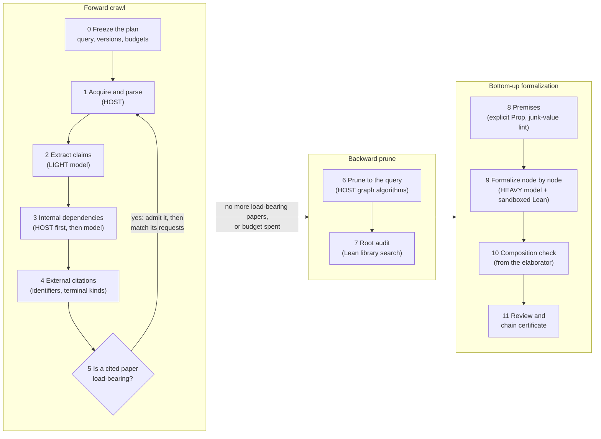

# How schema v0.3 works

Schema v0.3 (`research/0.3.0`) is the third rung of AgtXIv's *schema contract ladder*, which is numbered separately
from the older AgtXIv protocol versions. It is a research framework that starts from one arXiv paper and one of its
claims, follows that claim's dependencies through the papers it relies on, and then tries to formalize the resulting
branch in Lean 4 from the bottom up.

This page explains the workflow end to end: what each stage does, which program runs it, what it writes, and how far
each stage has actually been run. Implementation detail is in the host documents listed at the end, and the design
rationale is in the [v0.3 design document](../docs/superpowers/specs/2026-09-19-schema-v03-design.md).

> **Status (2026-09-24).** Every stage exists as code, and most stages have run on real data. No run has yet gone
> automatically from a paper to a Lean-checked query: every run so far ends `CHAIN_INCOMPLETE`. See
> [What has actually been run](#what-has-actually-been-run).

## The idea

The brief, condensed: take one arXiv paper and extract its mathematical claims, each with its internal and external
dependencies. Apply the same treatment to the papers it depends on, recursively, until the citations reach their
origin. Keep only the branch that leads to the query claim. Formalize that branch in Lean 4, from its earliest starting
points up to the query.

That gives the shape of the pipeline:

**forward crawl → backward prune → bottom-up formalization**

The order is set by cost. Crawling and extraction are cheap model work and formalization is expensive model work, so
the prune sits just before the expensive step.

## Five ground rules

1. **Models propose; the host decides.** A model call returns *candidates* in a fixed JSON schema: claims, citation
   matches, Lean terms. Only deterministic host code derives state (whether a node is blocked, covered or attemptable),
   through one published function, `host/core.py::derive_state`. No model output can set a state.
2. **Everything is bound to bytes.** Sources are frozen and hashed. A claim points at an exact byte span of a source
   file, and a quotation must occur verbatim and exactly once, or it is rejected.
3. **Nothing is ever "verified".** No state, field or report may contain `VERIFIED`. The strongest result is a *chain
   certificate*: *the formalized query holds **conditional on** P₁ … Pₖ*, with the premises read out of the Lean
   environment. Three things it cannot establish are recorded separately for human review: whether the Lean statement
   is faithful to the paper, whether the premises are inhabited, and whether the definitions mean what the paper
   means.
4. **Work is priced by decision type, not by stage.** HOST means deterministic programs (hashing, parsing, graph
   algorithms, Lean builds); DECISION means closed-choice classification; LIGHT means generative extraction and
   matching; HEAVY means proof construction. Only HEAVY needs a large model. A model's own confidence is stored as
   `SELF_REPORTED` and never advances an automatic gate; only a registered calibration curve could.
5. **Every run keeps its evidence.** A run writes receipts for each program and model call, a SQLite ledger of plans,
   reservations, budgets and issues, and immutable checkpoints. An audit script re-checks a finished run directory.

## The pipeline



| # | Stage | Tier | What happens | Main code |
|---|---|---|---|---|
| 0 | Freeze | HOST | The query, source versions, environment fingerprint, model routing, budgets and decision policy are pinned into a plan before anything runs. | `host/research.py` |
| 1 | Acquire and parse | HOST | Download the exact arXiv source version (bounded and optional), unpack it safely, and locate theorem-like environments, equations, paragraphs, labels, macros and the bibliography, all with UTF-8 byte anchors. | `host/ingest.py`, `host/bibtex.py`, `tools/extract_provisional_claims.py` |
| 2 | Extract claims | LIGHT | A model reads the frozen paper and returns claim candidates. Each is bound to a located occurrence or to an exact quotation, and lists the claims and citations its proof uses and the citations it only mentions (`CLAIM_REFERENCE_V1`). | `host/model.py`, `host/candidates.py`, `host/extract_batches.py` |
| 3 | Internal dependencies | HOST, then LIGHT and DECISION | Every `\ref`, `\eqref` and `\cite` is resolved deterministically first; model-proposed support comes second. Support is grouped: AND inside a group, OR across groups. Mentions go to a separate table and never become support. Every reference gets an edge or an explicit unresolved result. | `host/candidates.py`, `host/graph.py` |
| 4 | External citations | HOST + DECISION | Bibliography entries become explicit arXiv or DOI identifiers (with a bounded Crossref fallback). Each upstream gets a terminal kind: `ARXIV_SOURCE_AVAILABLE`, `PREARXIV_DOI_NO_SOURCE`, `MONOGRAPH`, `FOLKLORE_NO_PRIMARY_SOURCE`, `FREE_TEXT_UNRESOLVED` or `IN_LIBRARY`. A citation used in a proof becomes an *external request*, never an invented upstream statement. | `host/ingest.py`, `host/arxiv_metadata.py` |
| 5 | Admit and recurse | DECISION + LIGHT | A cited paper is admitted only if it lies upstream of a support edge on a path to the query; there is no depth parameter. An admitted paper goes through stages 1–4. Each external request is then matched to upstream claims as `CANDIDATE_SUPPORT`, `MISMATCH` or `UNCERTAIN`, with exact quotations, and the graph is pruned again. Budgets and a no-progress counter stop the crawl. Papers without TeX source can enter through a PDF reading path. | `host/research.py`, `host/recursive_graph.py`, `host/pdf_*.py` |
| 6 | Prune to the query | HOST | Keep support edges only; condense cycles (Tarjan SCC); take the query's ancestors; solve the AND/OR graph for minimum-cost routes, keeping ties; tag roots `FRONTIER` (not searched above) or `ORIGIN` (search exhausted). Edge criticality and blocked descendants are reported as deliverables. | `host/graph.py` |
| 7 | Root audit | HOST | For every root, search an index of the frozen Lean environment and record a `LIBRARY_SEARCHED` audit. The audit lists candidates only; a search result is never a binding. | `host/library.py`, `lean/LibraryIndex.lean` |
| 8 | Premises | HOST + HEAVY | A root that no library provides becomes an explicit Lean `Prop` premise, never an axiom. A junk-value lint flags statements that silently rely on Lean's default values (for example `sSup` of a set not shown to be nonempty and bounded). | `host/roots.py`, `host/scheduler.py` |
| 9 | Formalize bottom-up | HEAVY + DECISION | The pruned graph is walked in topological order. For each node the model writes a Lean statement and proof term. The host compiles it in a sandbox (no network, bounded memory and time), reads the actual type, premises and axioms back from Lean, and classifies each failure as `SYNTAX`, `MISSING_LEMMA`, `STATEMENT_WRONG`, `TIMEOUT`, `HEARTBEAT` or `UNPROVABLE_AS_STATED` to choose the retry. A node that exhausts its attempts becomes a `Prop` premise of everything above it, and the walk continues. | `host/scheduler.py`, `host/proof_walk.py`, `host/proof_backend.py`, `lean/GeneratedProofDriverV2.lean` |
| 10 | Compose | HOST | An edge counts as composed only if the elaborated proof actually uses the predecessor's declaration; otherwise it stays `NOT_COMPOSED`. | `host/proof_backend.py`, `host/lean.py` |
| 11 | Review and certify | HOST + human | Review templates are generated for people to fill in; only a person can accept. The host audits the run and writes a chain certificate whose premise list is read from Lean. | `host/review.py`, `host/certify.py`, `host/audit_*.py` |

### Which model does what

Model calls go through the Codex CLI, routed by a frozen profile (`profiles/engines.json`, see
[MODEL_ROUTING.md](host/MODEL_ROUTING.md)). The routing is copied into each plan, so later edits to the profile do
not change a plan that already exists.

| Operation | Tier | Model |
|---|---|---|
| `paper.extract` | LIGHT | `gpt-5.6-luna` (`gpt-5.6-terra` with `--extraction-profile LIGHT_TERRA`) |
| `dependency.match` | DECISION | `gpt-5.6-terra` |
| `autoformalization.failure_classify` | DECISION | `gpt-5.6-luna` |
| `autoformalization.lean`, `autoformalization.premise` | HEAVY | `gpt-6-astra` |

Acquisition, parsing, byte location, deduplication, graph pruning, quotas and Lean kernel runs are programs and call no
model.

## Running it

All commands run from the repository root with the repository's Python environment (`uv sync` creates `.venv`).

**1. Build the dependency graph for a query** (stages 0–6):

```sh
.venv/bin/python 'schema v0.3/host/research.py' \
  --paper 2607.26154v1 --query-label thm:solvable --candidate-exploration \
  --output 'schema v0.3/runs/my-new-run' \
  --max-papers 5 --max-model-calls 12
```

- Every plan needs a new output directory; `--resume` continues an interrupted plan.
- `--query-label` binds the claims at the named source labels as queries; without it, every extracted claim of the
  target paper is a query.
- `--network-sources` allows bounded, version-pinned arXiv downloads; `--imports` reuses frozen evidence from earlier
  runs, with its provenance.
- `--candidate-exploration` lets unreviewed candidates be explored. It grants no acceptance: review blockers propagate
  and nothing is promoted.
- Exit code **2** means `CHAIN_INCOMPLETE`, even when every research operation succeeded.

**2. Audit the run:**

```sh
.venv/bin/python 'schema v0.3/host/audit_research.py' \
  --run 'schema v0.3/runs/my-new-run' \
  --output 'schema v0.3/runs/my-new-run/integrity-report.json'
```

**3. Search the Lean library for the roots** (stage 7), inside a frozen Lean environment `E`:

```sh
.venv/bin/python 'schema v0.3/host/library.py' index --environment E --output O
.venv/bin/python 'schema v0.3/host/library.py' roots --graph G --index O/library-index.json --environment E --output root-audits.json
```

**4. Run the bottom-up proof walk** (stages 8–10) from a request file that names the pruned graph, the frozen
environment, root bindings or audits, and limits ([PROOF_BACKEND.md](host/PROOF_BACKEND.md)):

```sh
.venv/bin/python 'schema v0.3/host/proof_walk.py' --request request.json --output 'schema v0.3/runs/my-walk' \
  --max-model-calls 20 --max-proof-attempts 20 --max-node-attempts 4
```

**5. Review and certify** (stage 11): `host/review.py --graph G --ledger L --output O` writes review templates;
`host/certify.py --run R --reviews REVIEWS --output O` audits the run first and writes a chain certificate only if the
audit passes.

**Unit tests** (no model and no Lean by default; `AGTXIV_LEAN_TESTS=1` enables one real-Lean probe):

```sh
.venv/bin/python -m pytest 'schema v0.3/tests' 'schema v0.3/host/test_clause_evidence.py' -q
```

## Reading a run

Start with `summary.json`: queries, papers, node and edge counts, `accepted_support_edges`, the chain state and the
reasons it is incomplete. Then read `checkpoint.json` (the current derived state), `frontier.json` (what remains
unexplored and why) and `ledger.json` (plans, calls, reservations, budgets, issues). Immutable graph and checkpoint
histories sit beside them, so every intermediate state can be reproduced. A proof walk adds one receipt per attempt,
the compiled Lean evidence and, when the audit passes, a `ChainCertificate`.

## What has actually been run

| Stage | Furthest real run (all recorded in [STATUS.md](STATUS.md), in Chinese) |
|---|---|
| 1–6 | The recursive controller connected up to four papers around arXiv:2607.26154: 240 claim candidates in the target paper and a 683-node query graph with 269 support groups. 37 match judgements await review, 2 links were rejected, and accepted support edges number 0. |
| 6–7 | A single-theorem query (`--query-label thm:solvable`) with library root audits, run through a stub proof walk that calls neither a model nor Lean, reaches 5 attemptable nodes on the target-paper graph and 6 after joining upstream papers. The legacy graph reaches 0. |
| 9–10 | The proof worker has one real single-node model→Lean run. No real walk over a query graph has run. |
| Lean | The 60-module Lean branch behind `thm:solvable` compiles in one common environment (the Lean v4.33.0 that physlib uses, mathlib `db584cd6`, and the migrated AgtXIv/Quantumlib layer). Its 54 target declarations (44 theorems, 10 definitions) audit with only `propext`, `Classical.choice` and `Quot.sound`. An agent wrote and repaired this branch; the automatic worker did not produce it, and its terminal theorem is not yet bound to the graph's query node. |
| 11 | No human review record exists yet. |

**Open gaps.**
- The Lean statements have not been reviewed against the paper's sentences.
- The earliest-origin search is unchanged, and recursion still needs explicit arXiv identifiers or imported PDFs.
- Library search is lexical and weak.
- No calibration curve exists, so every model decision stays `SELF_REPORTED`.

## What this public version leaves out

The run records under `schema v0.3/runs/` are not published here. They contain arXiv source files whose licences do
not permit redistribution, journal PDFs, and verbatim statements extracted from papers, so they are kept in a local
archive. For the same reason one migration record, `epoch-migration/runs/20260919-full-case/query-gap-report.json`,
which quotes a theorem of the query paper, is omitted. Paths under `runs/` in this directory's documents refer to that
archive. Some inputs that read it will not work from this repository alone:
- 16 of the 19 run profiles in `profiles/`;
- `host/validate.py`, `host/arxiv_metadata.py` and two migration scripts (`host/concrete_physlib_bridge.py`,
  `host/extension_migration.py`);
- the optional real-environment test in `tests/test_library.py`.

## Repository layout

| Path | Contents |
|---|---|
| `host/` | The Python host: `research.py` (recursive controller), `ingest.py`, `model.py`, `candidates.py` (extraction and binding), `graph.py` (pruning), `recursive_graph.py` (cross-paper joins), `library.py`, `scheduler.py` + `proof_walk.py` + `proof_backend.py` (proof worker), `lean.py`, `review.py`, `certify.py`, `audit_*.py`, `core.py` (state derivation), and the PDF path (`pdf_*.py`). `pipeline.py` is the older historical-graph migration case. |
| `schemas/` | Draft 2020-12 JSON contracts: plan, task, receipts, ledgers, support groups, terminal records, declaration bindings, nonvacuity and composition witnesses, human review, chain certificate. |
| `lean/` | Lean drivers (`GeneratedProofDriverV2.lean`, `LibraryIndex.lean`, `EnvironmentAudit.lean`), the query branch's modules, and formalization plans. |
| `epoch-migration/` | Migration of earlier AgtXIv Lean projects into one common Lean/mathlib/physlib epoch, with compile and audit records. |
| `profiles/` | Frozen model routing (`engines.json`) and run profiles. |
| `tests/` | Unit tests; fixtures are synthetic. |
| `reviews/`, `REVIEW-*.md` | Dated reviews of the framework and of individual mathematical points. |
| `STATUS.md` | The running record of results and limits (in Chinese). |

## Further reading

- [README.md](README.md): implemented boundaries and design decisions.
- [host/INGEST.md](host/INGEST.md), [host/SEMANTIC.md](host/SEMANTIC.md), [host/GRAPH.md](host/GRAPH.md),
  [host/OUTPUT_BATCHES.md](host/OUTPUT_BATCHES.md), [host/PDF_REGIONS.md](host/PDF_REGIONS.md),
  [host/MODEL_ROUTING.md](host/MODEL_ROUTING.md), [host/PROOF_BACKEND.md](host/PROOF_BACKEND.md): one document per
  host stage.
- [lean/README.md](lean/README.md) and [epoch-migration/README.md](epoch-migration/README.md): formal evidence and the
  common Lean environment.
- [The v0.3 design document](../docs/superpowers/specs/2026-09-19-schema-v03-design.md): the central loop, termination
  rules, and what a completed chain does and does not prove.
- [`schema v0.1/PENDING_TESTS.md`](../schema%20v0.1/PENDING_TESTS.md): every test scenario, executed or pending.
